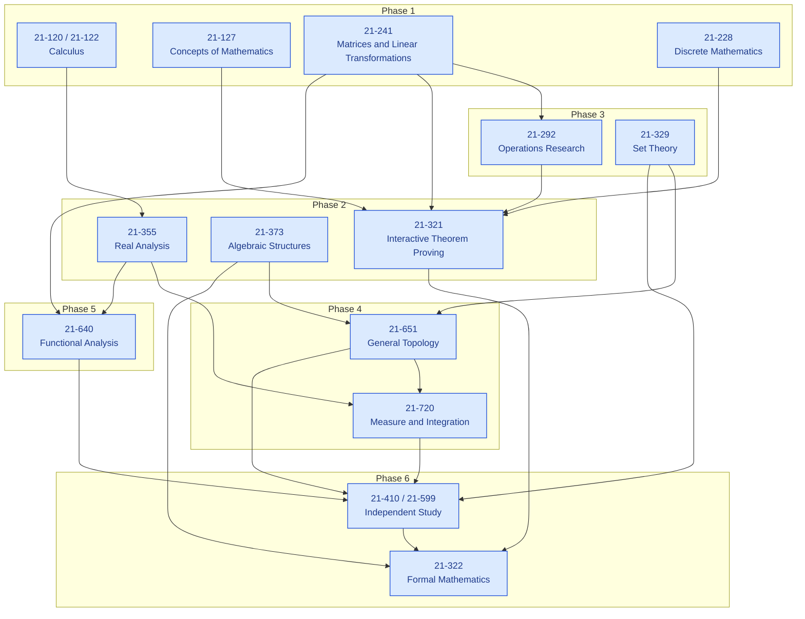
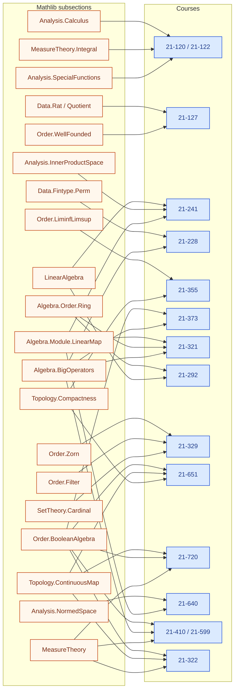

[](https://github.com/catskillsresearch/fabbro/actions/workflows/build.yml)

# Formalization of a BS in Measurement Theory

The accompanying report, *Formalization of a BS in Measurement Theory*, is
by **Lars Warren Ericson** (independent researcher, d/b/a Catskills Research
Company). It is being prepared for the Carnegie Mellon University School of
Computer Science Technical Report series as **CMU-CS-26-XXX**, with
cross-archival to arXiv under cs.LO and math.LO.

This repository reconstructs an undergraduate path through the CMU 21-xxx
catalog, sequenced so that Dana Scott's 1964 measurement theorems (1.1--4.1)
and their extension to infinite Boolean algebras can be proved end to end.
Each course contributes one problem that requires the full toolkit of that
course. Solutions are written in English and formalized in Lean 4 / Mathlib.

The student of record for the problem set is Giovanni Fabbro. The capstone
source is Dana S. Scott, *Measurement Structures and Linear Inequalities*
(J. Math. Psychology 1 (1964), 233–247).

The pin is `leanprover/lean4:v4.34.0-rc1`.

## Report and archival files

| File | Role |
|---|---|
| `arxiv.md` | CMU technical-report narrative and syllabus |
| `arxiv.pdf` | Built CMU report PDF for cross-archival |
| `docs/CMU_TECH_REPORT.md` | Report-number, build, and release checklist |
| `courses/` | Per-course English solutions |
| `BSinMeasurementTheory/` | Sorry-free Lean 4 formalizations |
| `BSinMeasurementTheory.lean` | Root importer |

## Syllabus

| Phase | Course | Title | Role toward Scott (1964) |
| :---: | :---: | :--- | :--- |
| 1 | [21-120 / 21-122](courses/21-120-21-122.md) | Differential and Integral Calculus / Integration and Approximation | FTC, comparison, integration by parts, Taylor remainder |
| 1 | [21-127](courses/21-127.md) | Concepts of Mathematics | Equivalence relations, explicit bijections, induction |
| 1 | [21-241](courses/21-241.md) | Matrices and Linear Transformations | Bases, dual bases, and the vector-space language of Theorem 1.1 |
| 1 | [21-228](courses/21-228.md) | Discrete Mathematics | Permutations, multisets, and the counting behind Theorems 1.2 and 3.2 |
| 2 | [21-355](courses/21-355.md) | Principles of Real Analysis I | Completeness, limsup/liminf, and compactness from axioms |
| 2 | [21-373](courses/21-373.md) | Algebraic Structures | Atoms and characteristic functions of finite Boolean algebras |
| 2 | [21-321](courses/21-321.md) | Interactive Theorem Proving | Formal statements of Theorems 1.1 and 1.2, and their equivalence |
| 3 | [21-292](courses/21-292.md) | Operations Research I | Simplex and LP duality, deriving Kuhn--Tucker / Theorem 1.1 from the dual |
| 3 | [21-329](courses/21-329.md) | Set Theory | Zorn's lemma, ultrafilters, and cardinal arithmetic |
| 4 | [21-651](courses/21-651.md) | General Topology | Stone spaces, compactness via Tychonoff, Stone representation |
| 4 | [21-720](courses/21-720.md) | Measure and Integration | Riesz representation and the induced finitely additive measure on \(B\) |
| 5 | [21-640](courses/21-640.md) | Introduction to Functional Analysis | Hahn--Banach extension, the step Scott cites and leaves unproved |
| 6 | [21-410 / 21-599](courses/21-410-21-599.md) | Independent Study | Full reconstruction of the infinite-algebra extension of Theorem 4.1 |
| 6 | [21-322](courses/21-322.md) | Topics in Formal Mathematics | Proof that the finite atomic picture is what the infinite machinery reduces to |

The conceptual buildup of that sequence is Figure 1. The Mathlib
subsections required to read each course's Lean are Figure 2. The Lean
library does not import across courses.

<!-- figure-caption: Conceptual buildup of the reconstructed 21-xxx syllabus toward Scott (1964). Blue nodes are courses, grouped by phase. -->


<!-- figure-caption: Mathlib subsections required to read each course. Orange nodes are Mathlib; blue nodes are courses. -->


## Build

```bash
lake exe cache get
lake build
bash scripts/build_arxiv_pdf.sh
```

`lake build` typechecks `BSinMeasurementTheory`. The PDF script regenerates
`arxiv.tex` from `arxiv.md` and the course notes, compiles the CMU report
cover, and writes `dist/arxiv_submit.zip`.
