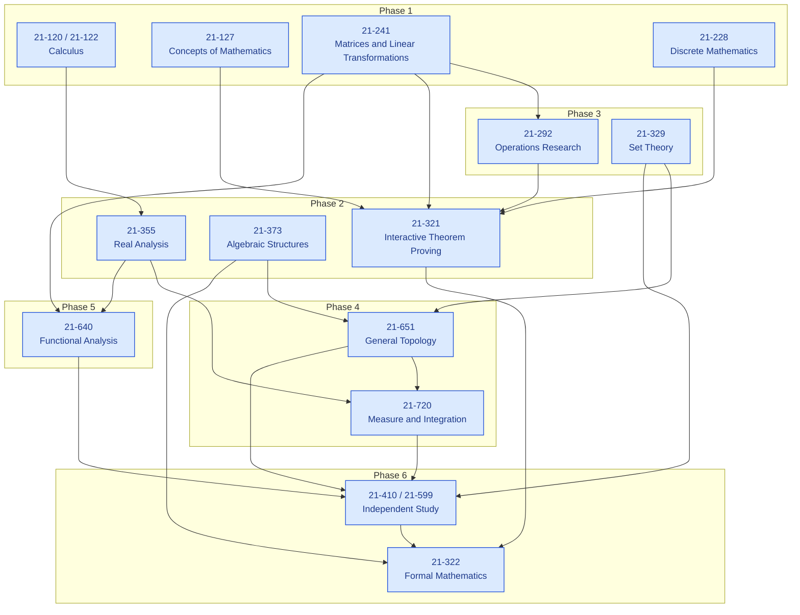
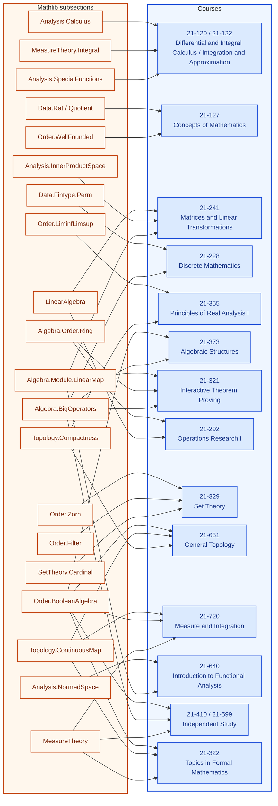

# Formalization of a BS in Measurement Theory

**Authors.** Lars Warren Ericson (independent researcher, d/b/a Catskills
Research Company; lars.ericson@catskillsresearch.com).
**Technical report.** CMU-CS-26-XXX, School of Computer Science, Carnegie
Mellon University, Pittsburgh, PA 15213.
**Source paper.** Dana S. Scott, *Measurement Structures and Linear
Inequalities*, Journal of Mathematical Psychology 1 (1964), 233–247.
**Repository.** https://github.com/catskillsresearch/fabbro
**Cross-archive.** This report will also be deposited on arXiv in cs.LO and
math.LO.

---

## Abstract

This report presents a reconstructed Carnegie Mellon undergraduate path
through the Mathematical Sciences 21-xxx catalog, sequenced so that Dana
Scott's 1964 measurement theorems (1.1--4.1) and their extension to infinite
Boolean algebras can be proved end to end. Each course contributes one
problem that requires the full toolkit of that course rather than a single
technique in isolation. Solutions are written in English and then formalized
in Lean 4 / Mathlib. The accompanying library `BSinMeasurementTheory` is
sorry-free under the pinned toolchain `leanprover/lean4:v4.34.0-rc1` and
introduces no project axioms beyond Mathlib's classical footprint. Large-language-model
assistance was used in drafting solutions, but every accepted declaration is
checked by Lean's kernel. The complete source and a reproducible build
pipeline are publicly available with this report.

## Introduction

Measurement theory asks when qualitative comparisons can be represented by
real numbers. Scott's 1964 paper organizes several such representation
questions around a finite theory of homogeneous linear inequalities, with
applications to intransitive indifference, ordered utility differences, and
subjective probability. The infinite direction, which Scott announced but
did not carry out, runs through Stone spaces, positive functionals,
Hahn--Banach extension, and Riesz representation.

The pedagogical claim of this report is that a complete undergraduate
mathematics major at Carnegie Mellon already contains the pieces of that
argument, if the courses are taken in the right order and each is asked to
do real work. The syllabus below is that ordering. It is framed as a
Bachelor of Science in Measurement Theory: not a new degree program, but a
reading of the existing catalog as a single connected proof.

The student of record for the problem set is Giovanni Fabbro. Each problem
is built so that quoting a theorem from a later course is not available: the
calculus problem uses the fundamental theorem, comparison, and Taylor
remainders; the linear-algebra problem speaks the dual-space language of
Scott's Theorem 1.1; the discrete-mathematics problem is the combinatorial
counting behind Theorems 1.2 and 3.2; and the independent-study problem
assembles set theory, topology, measure, and functional analysis into the
infinite extension of Theorem 4.1.

The formalizations live in the Lean library `BSinMeasurementTheory`. Each
course snippet is a self-contained module. The root file
`BSinMeasurementTheory.lean` imports all of them. The English arguments occupy the body of this report, in syllabus order,
with each Lean module inlined next to the claim it proves. The appendix
is an index of filenames, each linking to the source on GitHub.

## Syllabus

| Phase | Course | Title | Role toward Scott (1964) |
| :---: | :---: | :--- | :--- |
| 1 | 21-120 / 21-122 | Differential and Integral Calculus / Integration and Approximation | FTC, comparison, integration by parts, Taylor remainder |
| 1 | 21-127 | Concepts of Mathematics | Equivalence relations, explicit bijections, induction |
| 1 | 21-241 | Matrices and Linear Transformations | Bases, dual bases, and the vector-space language of Theorem 1.1 |
| 1 | 21-228 | Discrete Mathematics | Permutations, multisets, and the counting behind Theorems 1.2 and 3.2 |
| 2 | 21-355 | Principles of Real Analysis I | Completeness, limsup/liminf, and compactness from axioms |
| 2 | 21-373 | Algebraic Structures | Atoms and characteristic functions of finite Boolean algebras |
| 2 | 21-321 | Interactive Theorem Proving | Formal statements of Theorems 1.1 and 1.2, and their equivalence |
| 3 | 21-292 | Operations Research I | Simplex and LP duality, deriving Kuhn--Tucker / Theorem 1.1 from the dual |
| 3 | 21-329 | Set Theory | Zorn's lemma, ultrafilters, and cardinal arithmetic |
| 4 | 21-651 | General Topology | Stone spaces, compactness via Tychonoff, Stone representation |
| 4 | 21-720 | Measure and Integration | Riesz representation and the induced finitely additive measure on $B$ |
| 5 | 21-640 | Introduction to Functional Analysis | Hahn--Banach extension, the step Scott cites and leaves unproved |
| 6 | 21-410 / 21-599 | Independent Study | Full reconstruction of the infinite-algebra extension of Theorem 4.1 |
| 6 | 21-322 | Topics in Formal Mathematics | Proof that the finite atomic picture is what the infinite machinery reduces to |

The conceptual buildup of that sequence is Figure 1. The Mathlib
subsections required to read each course's Lean are Figure 2. The Lean
library does not import across courses.

<!-- figure-caption: Conceptual buildup of the reconstructed 21-xxx syllabus toward Scott (1964). Blue nodes are courses, grouped by phase. Course nodes are hyperlinked to the corresponding section. -->

<!-- figure-caption: Mathlib subsections required to read each course. Orange nodes are Mathlib; blue nodes are courses. Course nodes are hyperlinked to the corresponding section. -->

Every course problem is solved in two layers: an English mathematical
argument, and a Lean 4 formalization using Mathlib, with numerical examples
re-checked in Lean when they appear. Course 21-322 is opportunistic: it
should be taken in a term that overlaps real analysis or order theory in
Lean, but the standing problem is independent of that term's advertised
topic.

The remainder of this report is the problem set itself, in syllabus order.

## References

**[Sco64]** Dana S. Scott, *Measurement Structures and Linear Inequalities*,
Journal of Mathematical Psychology 1 (1964), 233–247.

**[KP59]** L. G. Kraft, J. D. Pratt, and A. Seidenberg, *Intuitive Probability
on Finite Sets*, Annals of Mathematical Statistics 30 (1959), 408–419.

**[Kel59]** J. L. Kelley, *Measures on Boolean Algebras*, Pacific Journal of
Mathematics 9 (1959), 1165–1177.
