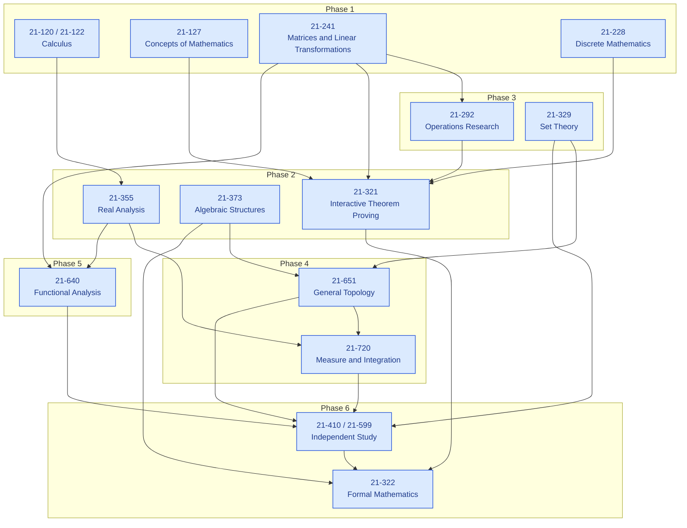
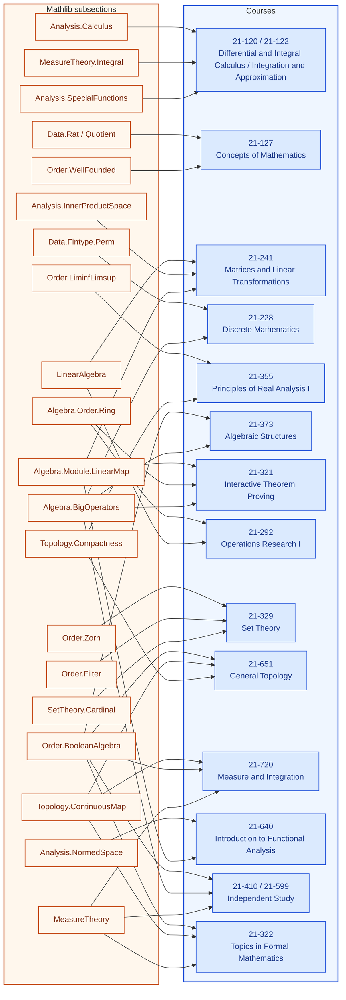

# Formalization of a BS in Measurement Theory

**Authors.** Lars Warren Ericson (independent researcher, d/b/a Catskills
Research Company; lars.ericson@catskillsresearch.com).
**Technical report.** CMU-CS-26-XXX, School of Computer Science, Carnegie
Mellon University, Pittsburgh, PA 15213.
**Source paper.** Dana S. Scott, *Measurement Structures and Linear
Inequalities*, Journal of Mathematical Psychology 1 (1964), 233–247.
**Repository.** https://github.com/catskillsresearch/fabbro
**Cross-archive.** This report will also be deposited on arXiv in cs.LO and
math.LO.

---

## Abstract

This report presents a reconstructed Carnegie Mellon undergraduate path
through the Mathematical Sciences 21-xxx catalog, sequenced so that Dana
Scott's 1964 measurement theorems (1.1--4.1) and their extension to infinite
Boolean algebras can be read for understanding after these courses are taken
and proved end to end. Each course contributes one
problem that requires the full toolkit of that course rather than a single
technique in isolation. Solutions are written in English and then formalized
in Lean 4 / Mathlib. The accompanying library `BSinMeasurementTheory` is
sorry-free under the pinned toolchain `leanprover/lean4:v4.34.0-rc1` and
introduces no project axioms beyond Mathlib's classical footprint. Large-language-model
assistance was used in drafting solutions, but every accepted declaration is
checked by Lean's kernel. The complete source and a reproducible build
pipeline are publicly available with this report.

## Introduction

### A role for AI in goal-directed college advising in mathematics

Imagine that a first-year student at Carnegie Mellon told their faculty advisor that their goal 
for their undergraduate degree was to be able to read a paper on Measurement Theory
written by Dana Scott in 1964.  This report is an example of responsible answer to that question,
generated with help of large language models. It turns out to be a map of Scott's own
undergraduate training. It is a model of highly individually 
tailored automated advisement to ensure that the student will master the skills
needed to read the paper for understanding and be able, in turn, to reproduce and 
teach the ideas and proofs it contains to themselves and others.  This is a level 
of advising intended to augment and improve on typical standards of advice received
by undergraduates.  The selection of Scott's 1964 paper is not intended to recommend an actual degree
program in Measurement Theory, but to illustrate this unique AI-assisted advisement
tool.  The tool idea is not a criticism of current advisement practices, just a unique
way to augment it.

Measurement theory asks when qualitative comparisons can be represented by
real numbers. Scott's 1964 paper organizes several such representation
questions around a finite theory of homogeneous linear inequalities, with
applications to intransitive indifference, ordered utility differences, and
subjective probability. The infinite direction, which Scott announced but
did not carry out, runs through Stone spaces, positive functionals,
Hahn--Banach extension, and Riesz representation.

The pedagogical claim of this report is that a complete undergraduate
mathematics major at Carnegie Mellon already contains the pieces of that
argument, if the courses are taken in the right order and each is asked to
do real work. The syllabus below is that ordering. It is framed as a
Bachelor of Science in Measurement Theory: not a new degree program, but a
reading of the existing catalog as a single connected proof.

For each course, we propose and solve, in mathematical English and in Lean, a hypothetical capstone problem which
exercises the key features of the course needed to read Scott 1964 for understanding.
We highlight with diagrams exactly what features of Lean's Mathlib (and hence,
exactly what mathematics) need to be mastered to solve each capstone problem.

Each problem
is built so that quoting a theorem from a later course is not available: the
calculus problem uses the fundamental theorem, comparison, and Taylor
remainders; the linear-algebra problem speaks the dual-space language of
Scott's Theorem 1.1; the discrete-mathematics problem is the combinatorial
counting behind Theorems 1.2 and 3.2; and the independent-study problem
assembles set theory, topology, measure, and functional analysis into the
infinite extension of Theorem 4.1.

The formalizations live in the Lean library `BSinMeasurementTheory`. Each
course snippet is a self-contained module. The root file
`BSinMeasurementTheory.lean` imports all of them. The English arguments occupy the body of this report, in syllabus order,
with each Lean module inlined next to the claim it proves. The appendix
is an index of filenames, each linking to the source on GitHub.

### Syllabus derived from the goal of reading Scott 1964

| Phase | Course | Title | Role toward Scott (1964) |
| :---: | :---: | :--- | :--- |
| 1 | 21-120 / 21-122 | Differential and Integral Calculus / Integration and Approximation | FTC, comparison, integration by parts, Taylor remainder |
| 1 | 21-127 | Concepts of Mathematics | Equivalence relations, explicit bijections, induction |
| 1 | 21-241 | Matrices and Linear Transformations | Bases, dual bases, and the vector-space language of Theorem 1.1 |
| 1 | 21-228 | Discrete Mathematics | Permutations, multisets, and the counting behind Theorems 1.2 and 3.2 |
| 2 | 21-355 | Principles of Real Analysis I | Completeness, limsup/liminf, and compactness from axioms |
| 2 | 21-373 | Algebraic Structures | Atoms and characteristic functions of finite Boolean algebras |
| 2 | 21-321 | Interactive Theorem Proving | Formal statements of Theorems 1.1 and 1.2, and their equivalence |
| 3 | 21-292 | Operations Research I | Simplex and LP duality, deriving Kuhn--Tucker / Theorem 1.1 from the dual |
| 3 | 21-329 | Set Theory | Zorn's lemma, ultrafilters, and cardinal arithmetic |
| 4 | 21-651 | General Topology | Stone spaces, compactness via Tychonoff, Stone representation |
| 4 | 21-720 | Measure and Integration | Riesz representation and the induced finitely additive measure on $B$ |
| 5 | 21-640 | Introduction to Functional Analysis | Hahn--Banach extension, the step Scott cites and leaves unproved |
| 6 | 21-410 / 21-599 | Independent Study | Full reconstruction of the infinite-algebra extension of Theorem 4.1 |
| 6 | 21-322 | Topics in Formal Mathematics | Proof that the finite atomic picture is what the infinite machinery reduces to |

The conceptual buildup of that sequence is Figure 1. The Mathlib
subsections required to read each course's Lean are Figure 2. The Lean
library does not import across courses.

<!-- figure-caption: Conceptual buildup of the reconstructed 21-xxx syllabus toward Scott (1964). Blue nodes are courses, grouped by phase. Course nodes are hyperlinked to the corresponding section. -->

<!-- figure-caption: Mathlib subsections required to read each course. Orange nodes are Mathlib; blue nodes are courses. Course nodes are hyperlinked to the corresponding section. -->

Every course problem is solved in two layers: an English mathematical
argument, and a Lean 4 formalization using Mathlib, with numerical examples
re-checked in Lean when they appear. Course 21-322 is opportunistic: it
should be taken in a term that overlaps real analysis or order theory in
Lean, but the standing problem is independent of that term's advertised
topic.

The remainder of this report is the problem set itself, in syllabus order.

### How Scott's likely undergraduate curriculum aligns with the proposed syllabus

While his official transcript is not available, we can construct a highly educated, historically grounded **speculative course schedule** for Dana Scott’s eight semesters at UC Berkeley (Fall 1950 to Spring 1954). 

This reconstruction is based on the standard requirements for a B.A. in Mathematics in the College of Letters and Science during the early 1950s, combined with specific historical records from Scott’s own Turing Award interviews and accounts from logicians like Patrick Suppes and Paolo Mancosu. 

Here is a guess at what his 8-semester progression of 4–5 courses a term might have looked like:

#### Freshman Year (1950–1951): Laying the Groundwork
As a freshman math major, Scott would have been required to tackle the standard lower-division calculus sequence, university requirements (like English and American Institutions), and physical sciences.

- **Fall 1950**
  - Calculus I (Analytic Geometry & Differential Calculus)
  - General Physics (Mechanics)
  - English 1A (Composition / Subject A requirement)
  - Elementary German I (German or French was a mandatory language requirement for math majors; German was the lingua franca of logic at the time).
- **Spring 1951**
  - Calculus II (Integral Calculus)
  - General Physics (Electricity & Magnetism)
  - Elementary German II
  - Introduction to Philosophy (to satisfy humanities requirements and his growing interest in foundations).
  - American History & Institutions (university requirement).

#### Sophomore Year (1951–1952): The Shift Toward Logic
During this year, Scott would finish lower-division math and begin exploring the intersection of mathematics and philosophy.

- **Fall 1951**
  - Calculus III (Multivariable Calculus)
  - Theory of Equations / Linear Algebra
  - Intermediate German (Reading mathematical German)
  - Introduction to Formal Logic (Philosophy Department)
- **Spring 1952**
  - Calculus IV (Differential Equations)
  - Modern / Abstract Algebra I
  - **Philosophy of Science** — Historical fact: logician Patrick Suppes was a visiting professor from Stanford during this exact semester and explicitly noted that he taught this course with Dana Scott and Richard Montague sitting in as undergraduates.
  - Elective: Introductory Astronomy or Chemistry

#### Junior Year (1952–1953): The Prodigy Emerges
By his junior year, Scott was recognized as possessing unusual talent. He would be tackling the core upper-division math major requirements while fast-tracking into foundational logic.

- **Fall 1952**
  - Advanced Calculus / Real Analysis I
  - Modern / Abstract Algebra II
  - Foundations of Mathematics
  - Independent Study / Reading Course — Historical fact: Scott noted in his oral history that he spent time heavily studying J.C.C. McKinsey's write-up of Tarski's decision method for elementary algebra and geometry.
- **Spring 1953**
  - Advanced Calculus / Real Analysis II
  - Introduction to Topology
  - Symbolic Logic (Upper-division Philosophy/Math cross-list)
  - History of Modern Philosophy (Kant to 20th Century)

#### Senior Year (1953–1954): The Tarski Graduate Seminars
In his final year, Scott functioned essentially as a graduate student. Alfred Tarski's famous graduate seminars were the center of the Berkeley logic universe, and Scott was fully immersed in them.

- **Fall 1953**
  - **Math 235: Set Theory (Graduate Level)** — Historical fact: this was Tarski's legendary graduate set theory course, which Mancosu's historical text notes was a staple of the Berkeley logic group.
  - Complex Analysis
  - Point Set Topology (Kelley)
  - Seminar in Logic — likely interacting closely with Leon Henkin, who was hired to the Berkeley math faculty in Fall 1953.
- **Spring 1954**
  - Metamathematics and Algebra (Graduate Level with Tarski)
  - Differential Geometry
  - Philosophy of Language / Semantics — given his later development of Scott--Montague semantics, he was likely taking advanced philosophy courses regarding meaning and language.
  - Graduate Independent Research (leading to his graduation and brief transition into Berkeley's graduate program before he left for Princeton).

####  Why this guess is highly probable
Back in the 1950s, the pathway for a math major was quite rigid in the first two years (Calculus, Physics, Language) but highly flexible in the last two years for honors students. Because Scott was brought into Alfred Tarski's inner circle early on, his junior and senior years would look much less like a standard math student's (who would be taking applied math and statistics) and much more like a PhD student's, dominated by courses in **Model Theory, Set Theory, Metamathematics, and Philosophy**.

#### How this compares to our Scott 1964-derived curriculum

The reconstructed Berkeley years and the 21-xxx syllabus are the same argument
read in two catalogs. Freshman calculus is 21-120 / 21-122. Sophomore linear
algebra is 21-241. Junior abstract algebra and real analysis are 21-373 and
21-355. Junior topology is 21-651. Senior set theory with Tarski is 21-329.
The independent reading of McKinsey--Tarski, and the senior research term, are
21-410 / 21-599. Formal logic, foundations, symbolic logic, and the
metamathematics seminars are what 21-127 and 21-321 are for: first the
language of proof, then the ability to write Scott's Theorems 1.1 and 1.2 as
checked declarations. The Suppes philosophy-of-science semester is the
nearest 1952 analogue of the paper itself---measurement as a problem about
when qualitative comparisons become numbers---rather than of any single
21-xxx listing.

What the 1950s schedule does not contain, and what this syllabus therefore
has to add, are the pieces Scott used or announced without packaging them as
undergraduate courses. Operations research (21-292) is the modern home of
the homogeneous linear inequalities and the dual that yield Theorem 1.1;
Dantzig's simplex method was new in Scott's student years and would not have
been a Berkeley mathematics requirement. Measure and integration (21-720)
and functional analysis (21-640) are the Hahn--Banach and Riesz steps he
cites and leaves unproved; they are absent from the reconstructed
transcript, which is consistent with their being the missing infinite
direction of Theorem 4.1. Discrete mathematics (21-228) isolates the
permutation counting behind Theorems 1.2 and 3.2 that a 1950s algebra course
would have treated only in passing. Topics in formal mathematics (21-322) is
the Lean-era counterpart of the metamathematics seminar: a check that the
finite atomic picture is what the infinite machinery reduces to.

The comparison also says what to omit. Physics, German, composition, and
American Institutions are college requirements, not steps toward the 1964
paper. Multivariable calculus, differential equations, complex analysis, and
differential geometry are real mathematics Scott almost certainly took, and
none of them is needed to read the measurement theorems. Philosophy of
language points forward to Scott--Montague semantics, not back to linear
inequalities. The 21-xxx list is therefore not a reconstruction of a full
Berkeley B.A. It is the subsequence that remains when the goal is fixed as
Scott 1964: the courses he would have recognized, plus the dual, measure,
and extension theorems that his undergraduate years left unnamed.

## References

**[Sco64]** Dana S. Scott, *Measurement Structures and Linear Inequalities*,
Journal of Mathematical Psychology 1 (1964), 233–247.

**[KP59]** L. G. Kraft, J. D. Pratt, and A. Seidenberg, *Intuitive Probability
on Finite Sets*, Annals of Mathematical Statistics 30 (1959), 408–419.

**[Kel59]** J. L. Kelley, *Measures on Boolean Algebras*, Pacific Journal of
Mathematics 9 (1959), 1165–1177.
