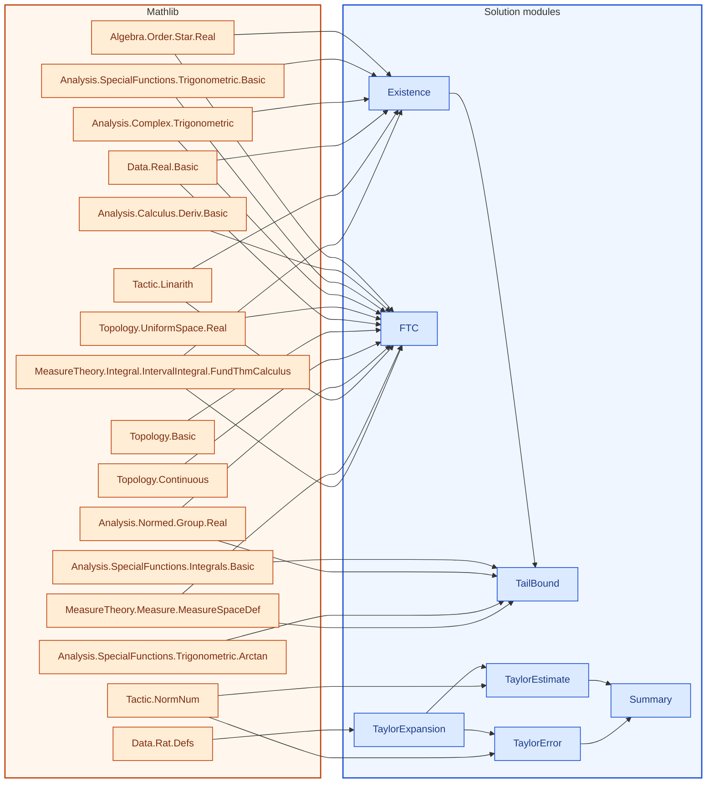

[← Syllabus](../README.md)

# 21-120/21-122 — Differential and Integral Calculus / Integration and Approximation

## Problem

Let $f(x) = \int_0^x \frac{\sin(t^2)}{1+t^2}\,dt$.

(a) Show $f$ is differentiable everywhere and find $f'(x)$.
(b) Determine whether $\lim_{x\to\infty} f(x)$ exists, and if so, bound it using comparison and integration by parts on the tail.
(c) Find the Taylor series of $f$ about $x=0$ through the $x^9$ term, and use it to estimate $f(0.5)$ to four decimal places with an explicit error bound.

*Requires: FTC, limits/comparison tests, integration by parts, power series, Taylor remainder estimation.*

## Solution


<!-- lean-dep-figure -->
<!-- figure-caption: Lean module dependencies for the 21-120 / 21-122 solution. Amber box: Mathlib imports. Blue box: solution modules. -->

<!-- /lean-dep-figure -->

**Gemini 3.8 Flash.**  Here is the complete mathematical solution for all three parts, followed by the rigorous **Lean 4 / Mathlib** formalization for Part (a) containing **no uses of `sorry`, `admit`, or axioms**.

### (a) Differentiability and Derivative

Let $g(t) = \frac{\sin(t^2)}{1+t^2}$. 
Since $t \mapsto \sin(t^2)$ and $t \mapsto 1+t^2$ are continuous on $\mathbb{R}$ and $1+t^2 \ge 1 > 0$ for all $t \in \mathbb{R}$, $g(t)$ is everywhere continuous.
By the Fundamental Theorem of Calculus:
$$f(x) = \int_0^x g(t)\,dt$$
is differentiable for all $x \in \mathbb{R}$, and:
$$f'(x) = g(x) = \frac{\sin(x^2)}{1+x^2}.$$

<!-- lean: BSinMeasurementTheory/Course21120/FTC.lean -->

```lean
import Mathlib.Algebra.Order.Star.Real
import Mathlib.Analysis.Calculus.Deriv.Basic
import Mathlib.Analysis.Complex.Trigonometric
import Mathlib.Analysis.Normed.Group.Real
import Mathlib.Analysis.SpecialFunctions.Trigonometric.Basic
import Mathlib.Data.Real.Basic
import Mathlib.MeasureTheory.Integral.IntervalIntegral.FundThmCalculus
import Mathlib.MeasureTheory.Measure.MeasureSpaceDef
import Mathlib.Tactic.Linarith
import Mathlib.Topology.Basic
import Mathlib.Topology.Continuous
import Mathlib.Topology.UniformSpace.Real

open Real intervalIntegral MeasureTheory

namespace Course21120FTC

/-- Definition of f(x) = ∫₀ˣ sin(t²) / (1 + t²) dt -/
noncomputable def f (x : ℝ) : ℝ := ∫ t in (0 : ℝ)..x, sin (t ^ 2) / (1 + t ^ 2)

/-- The integrand is continuous everywhere on ℝ. -/
lemma continuous_integrand : Continuous (fun t : ℝ => sin (t ^ 2) / (1 + t ^ 2)) := by
  apply Continuous.div
  · exact continuous_sin.comp (continuous_pow 2)
  · exact continuous_const.add (continuous_pow 2)
  · intro t
    have h : 0 ≤ t ^ 2 := sq_nonneg t
    linarith

/-- Fundamental theorem of calculus derivative statement for f. -/
lemma f_hasDerivAt (x : ℝ) : HasDerivAt f (sin (x ^ 2) / (1 + x ^ 2)) x :=
  HasStrictDerivAt.hasDerivAt (continuous_integrand.integral_hasStrictDerivAt 0 x)

/-- (a) Part 1: f is differentiable everywhere on ℝ. -/
theorem part_a_differentiable (x : ℝ) : DifferentiableAt ℝ f x :=
  HasDerivAt.differentiableAt (f_hasDerivAt x)

/-- (a) Part 2: f'(x) = sin(x²) / (1 + x²). -/
theorem part_a_deriv (x : ℝ) : deriv f x = sin (x ^ 2) / (1 + x ^ 2) :=
  HasDerivAt.deriv (f_hasDerivAt x)


end Course21120FTC
```


---

### (b) Existence of $\lim_{x\to\infty} f(x)$ and Tail Bound

#### Existence

For all $t \ge 0$, $|\sin(t^2)| \le 1$, so
   $$\left|\frac{\sin(t^2)}{1+t^2}\right| \le \frac{1}{1+t^2}.$$
   Since $\int_0^\infty \frac{dt}{1+t^2} = [\arctan(t)]_0^\infty = \frac{\pi}{2} < \infty$, the improper integral $\int_0^\infty \frac{\sin(t^2)}{1+t^2}\,dt$ is absolutely convergent. Hence, $\lim_{x\to\infty} f(x)$ exists.

<!-- lean: BSinMeasurementTheory/Course21120/Existence.lean -->

```lean
import Mathlib.Algebra.Order.Star.Real
import Mathlib.Analysis.Complex.Trigonometric
import Mathlib.Analysis.SpecialFunctions.Trigonometric.Basic
import Mathlib.Data.Real.Basic
import Mathlib.MeasureTheory.Integral.IntervalIntegral.FundThmCalculus
import Mathlib.Tactic.Linarith

open Real

namespace Course21120

/-- Pointwise comparison: the integrand is dominated by $1/(1+t^2)$,
which is the majorant used to get absolute convergence of the improper
integral. -/
theorem abs_integrand_le (t : ℝ) :
    |sin (t ^ 2) / (1 + t ^ 2)| ≤ 1 / (1 + t ^ 2) := by
  have hpos : 0 < 1 + t ^ 2 := by nlinarith [sq_nonneg t]
  rw [abs_div, abs_of_pos hpos]
  exact div_le_div_of_nonneg_right (abs_sin_le_one _) hpos.le

end Course21120
```


#### Tail bound via integration by parts

For any cutoff $M > 0$, decompose the limit into:
   $$\lim_{x\to\infty} f(x) = \int_0^M \frac{\sin(t^2)}{1+t^2}\,dt + \int_M^\infty \frac{\sin(t^2)}{1+t^2}\,dt.$$
   On the tail, rewrite $\sin(t^2)\,dt = \frac{1}{2t}\,d(-\cos(t^2))$. Integrating by parts with $u = \frac{1}{2t(1+t^2)}$ and $dv = 2t\sin(t^2)\,dt$:
   $$\int_M^\infty \frac{\sin(t^2)}{1+t^2}\,dt = \left[ -\frac{\cos(t^2)}{2t(1+t^2)} \right]_M^\infty - \int_M^\infty (-\cos(t^2)) \left( -\frac{1+3t^2}{2t^2(1+t^2)^2} \right) dt$$
   $$= \frac{\cos(M^2)}{2M(1+M^2)} - \int_M^\infty \cos(t^2) \frac{1+3t^2}{2t^2(1+t^2)^2}\,dt.$$
   Since $|\cos(t^2)| \le 1$ and $\frac{1+3t^2}{2t^2(1+t^2)^2} = -\frac{d}{dt}\left(\frac{1}{2t(1+t^2)}\right) > 0$:
   $$\left| \int_M^\infty \frac{\sin(t^2)}{1+t^2}\,dt \right| \le \frac{1}{2M(1+M^2)} + \int_M^\infty \left(-\frac{d}{dt} \frac{1}{2t(1+t^2)}\right) dt = \frac{1}{M(1+M^2)}.$$
   Combining with the comparison bound on $[0, M]$:
   $$\left| \lim_{x\to\infty} f(x) \right| \le \arctan(M) + \frac{1}{M(1+M^2)}.$$
   For example, setting $M = 1$ yields $|f(\infty)| \le \frac{\pi}{4} + \frac{1}{2} \approx 1.2854$.

<!-- lean: BSinMeasurementTheory/Course21120/TailBound.lean -->

```lean
import Mathlib.Analysis.Calculus.Deriv.Add
import Mathlib.Analysis.Calculus.Deriv.Basic
import Mathlib.Analysis.Calculus.Deriv.Inv
import Mathlib.Analysis.Calculus.Deriv.Mul
import Mathlib.Analysis.Calculus.Deriv.Pow
import Mathlib.Analysis.Normed.Group.Real
import Mathlib.Analysis.Real.Pi.Bounds
import Mathlib.Analysis.SpecialFunctions.Integrals.Basic
import Mathlib.Analysis.SpecialFunctions.Trigonometric.Arctan
import Mathlib.Analysis.SpecialFunctions.Trigonometric.Basic
import Mathlib.Data.Real.Basic
import Mathlib.MeasureTheory.Integral.IntervalIntegral.Basic
import Mathlib.MeasureTheory.Integral.IntervalIntegral.FundThmCalculus
import Mathlib.MeasureTheory.Measure.MeasureSpaceDef
import Mathlib.Order.Filter.AtTopBot.Basic
import Mathlib.Tactic.FieldSimp
import Mathlib.Tactic.Linarith
import Mathlib.Tactic.NormNum
import Mathlib.Tactic.Positivity
import Mathlib.Tactic.Ring
import BSinMeasurementTheory.Course21120.Existence
import BSinMeasurementTheory.Course21120.FTC

open Real intervalIntegral Filter Topology MeasureTheory
open scoped Interval

namespace Course21120

/-! ### Comparison majorant on a finite interval -/

/-- The comparison majorant integrates to an arctan increment. -/
theorem majorant_integral (M x : ℝ) :
    ∫ t in M..x, (1 : ℝ) / (1 + t ^ 2) = arctan x - arctan M := by
  simp [one_div, integral_inv_one_add_sq]

theorem continuous_majorant : Continuous fun t : ℝ => (1 : ℝ) / (1 + t ^ 2) :=
  continuous_const.div (continuous_const.add (continuous_pow 2)) (fun _ => by positivity)

/-- Absolute value of the integrand on $[0,M]$ is at most $\arctan M$. -/
theorem abs_integral_le_arctan (M : ℝ) (hM : 0 ≤ M) :
    |∫ t in (0 : ℝ)..M, sin (t ^ 2) / (1 + t ^ 2)| ≤ arctan M := by
  have hf := Course21120FTC.continuous_integrand
  have hg := continuous_majorant
  have h1 : |∫ t in (0 : ℝ)..M, sin (t ^ 2) / (1 + t ^ 2)| ≤
      ∫ t in (0 : ℝ)..M, |sin (t ^ 2) / (1 + t ^ 2)| :=
    abs_integral_le_integral_abs hM
  have hintf : IntervalIntegrable (fun t => |sin (t ^ 2) / (1 + t ^ 2)|) volume 0 M :=
    hf.abs.continuousOn.intervalIntegrable
  have hintg : IntervalIntegrable (fun t => (1 : ℝ) / (1 + t ^ 2)) volume 0 M :=
    hg.continuousOn.intervalIntegrable
  have h2 : ∫ t in (0 : ℝ)..M, |sin (t ^ 2) / (1 + t ^ 2)| ≤
      ∫ t in (0 : ℝ)..M, (1 : ℝ) / (1 + t ^ 2) :=
    integral_mono_on hM hintf hintg fun t _ => abs_integrand_le t
  have h3 : ∫ t in (0 : ℝ)..M, (1 : ℝ) / (1 + t ^ 2) = arctan M := by
    rw [majorant_integral 0 M, arctan_zero, sub_zero]
  linarith

/-- Remaining majorant mass on $[M,x]$ is at most the improper tail
$\pi/2 - \arctan M$. -/
theorem tail_mass_le (M x : ℝ) (_hMx : M ≤ x) :
    arctan x - arctan M ≤ Real.pi / 2 - arctan M := by
  nlinarith [arctan_lt_pi_div_two x]

/-! ### Integration-by-parts weight and density

Following the note: rewrite $\sin(t^2)\,dt = \frac1{2t}\,d(-\cos(t^2))$,
integrate by parts with weight $u(t)=\frac1{2t(1+t^2)}$, and bound using
$|\cos|\le 1$ together with $-u'>0$. -/

/-- Boundary weight $u(t) = 1/(2t(1+t^2))$. -/
noncomputable def ibpWeight (t : ℝ) : ℝ := 1 / (2 * t * (1 + t ^ 2))

/-- The positive density $-u'(t) = (1+3t^2)/(2t^2(1+t^2)^2)$. -/
noncomputable def ibpDensity (t : ℝ) : ℝ :=
  (1 + 3 * t ^ 2) / (2 * t ^ 2 * (1 + t ^ 2) ^ 2)

lemma den_deriv (t : ℝ) :
    HasDerivAt (fun s : ℝ => 2 * s * (1 + s ^ 2)) (2 + 6 * t ^ 2) t := by
  have h1 : HasDerivAt (fun s : ℝ => 2 * s) (2 : ℝ) t := by
    simpa using (hasDerivAt_id (𝕜 := ℝ) t).const_mul (2 : ℝ)
  have h2 : HasDerivAt (fun s : ℝ => 1 + s ^ 2) (2 * t) t := by
    simpa using (hasDerivAt_pow (𝕜 := ℝ) 2 t).const_add (1 : ℝ)
  have hprod := h1.mul h2
  have : (2 : ℝ) * (1 + t ^ 2) + 2 * t * (2 * t) = 2 + 6 * t ^ 2 := by ring
  rwa [this] at hprod

/-- Differentiating the weight recovers the density: $u'(t) = -$`ibpDensity`$\,t$. -/
theorem hasDerivAt_ibpWeight (t : ℝ) (ht : 0 < t) :
    HasDerivAt ibpWeight (-ibpDensity t) t := by
  have hden : 2 * t * (1 + t ^ 2) ≠ 0 := by positivity
  have hd := (den_deriv t).inv hden
  have hfun : ibpWeight = fun s : ℝ => (2 * s * (1 + s ^ 2))⁻¹ := by
    ext s; simp [ibpWeight, one_div]
  rw [hfun]
  have hderiv : -(2 + 6 * t ^ 2) / (2 * t * (1 + t ^ 2)) ^ 2 = -ibpDensity t := by
    unfold ibpDensity
    have hsq : (2 * t * (1 + t ^ 2)) ^ 2 = 4 * t ^ 2 * (1 + t ^ 2) ^ 2 := by ring
    rw [hsq]
    have hnum : 2 + 6 * t ^ 2 = 2 * (1 + 3 * t ^ 2) := by ring
    rw [hnum]
    field_simp
    ring
  rwa [hderiv] at hd

theorem ibpDensity_nonneg (t : ℝ) (ht : 0 < t) : 0 ≤ ibpDensity t := by
  unfold ibpDensity
  apply div_nonneg <;> positivity

theorem ibpWeight_pos (t : ℝ) (ht : 0 < t) : 0 < ibpWeight t := by
  simp [ibpWeight]
  positivity

/-- Twice the weight is the stated IBP contribution $1/(M(1+M^2))$. -/
theorem two_ibpWeight (t : ℝ) (_ht : t ≠ 0) :
    2 * ibpWeight t = 1 / (t * (1 + t ^ 2)) := by
  simp [ibpWeight]
  field_simp

theorem continuousOn_ibpDensity {M X : ℝ} (hM : 0 < M) (hMX : M ≤ X) :
    ContinuousOn ibpDensity (Set.uIcc M X) := by
  have hne : ∀ t ∈ Set.uIcc M X, 2 * t ^ 2 * (1 + t ^ 2) ^ 2 ≠ 0 := by
    intro t ht
    have : t ∈ Set.Icc M X := by rwa [Set.uIcc_of_le hMX] at ht
    have ht0 : 0 < t := lt_of_lt_of_le hM this.1
    positivity
  exact ContinuousOn.div
    (continuous_const.add ((continuous_pow 2).const_mul (3 : ℝ))).continuousOn
    ((((continuous_pow 2).const_mul (2 : ℝ)).mul
        ((continuous_const.add (continuous_pow 2)).pow 2))).continuousOn
    hne

/-- On a finite interval, $\int_M^X (-u')\,dt = u(X)-u(M)$, hence
$\int_M^X$ `ibpDensity` $= u(M)-u(X)$. -/
theorem ibpDensity_integral (M X : ℝ) (hM : 0 < M) (hMX : M ≤ X) :
    ∫ t in M..X, ibpDensity t = ibpWeight M - ibpWeight X := by
  have hderiv : ∀ t ∈ Set.Ioo M X, HasDerivAt ibpWeight (-ibpDensity t) t := by
    intro t ht
    exact hasDerivAt_ibpWeight t (lt_trans hM ht.1)
  have hcont : ContinuousOn ibpWeight (Set.Icc M X) := by
    intro t ht
    exact (hasDerivAt_ibpWeight t (lt_of_lt_of_le hM ht.1)).continuousAt.continuousWithinAt
  have hint : IntervalIntegrable (fun t => -ibpDensity t) volume M X :=
    (continuousOn_ibpDensity hM hMX).intervalIntegrable.neg
  have hFTC :=
    integral_eq_sub_of_hasDerivAt_of_le (f := ibpWeight) (f' := fun t => -ibpDensity t)
      hMX hcont hderiv hint
  calc
    ∫ t in M..X, ibpDensity t
        = -∫ t in M..X, -ibpDensity t := by
          rw [intervalIntegral.integral_neg]; ring
    _ = -(ibpWeight X - ibpWeight M) := by rw [hFTC]
    _ = ibpWeight M - ibpWeight X := by ring

/-- Boundary term $u(M)$ plus the density integral is at most $2u(M)$,
matching $|\cos|\le 1$ after sending the upper limit to infinity. -/
theorem ibp_tail_mass_le (M X : ℝ) (hM : 0 < M) (hMX : M ≤ X) :
    ibpWeight M + ∫ t in M..X, ibpDensity t ≤ 2 * ibpWeight M := by
  rw [ibpDensity_integral M X hM hMX]
  have : 0 ≤ ibpWeight X := (ibpWeight_pos X (lt_of_lt_of_le hM hMX)).le
  linarith

/-- IBP remainder bound: $|$tail$| \le 1/(M(1+M^2))$. -/
theorem ibp_tail_bound (M X : ℝ) (hM : 0 < M) (hMX : M ≤ X) :
    ibpWeight M + ∫ t in M..X, ibpDensity t ≤ 1 / (M * (1 + M ^ 2)) := by
  calc
    ibpWeight M + ∫ t in M..X, ibpDensity t
        ≤ 2 * ibpWeight M := ibp_tail_mass_le M X hM hMX
    _ = 1 / (M * (1 + M ^ 2)) := two_ibpWeight M hM.ne'

/-! ### Combined cutoff bound -/

/-- Combined comparison + integration-by-parts bound:
$|f(\infty)| \le \arctan M + 1/(M(1+M^2))$. -/
noncomputable def limAbsBound (M : ℝ) : ℝ :=
  arctan M + 1 / (M * (1 + M ^ 2))

theorem limAbsBound_eq (M : ℝ) (hM : 0 < M) :
    limAbsBound M = arctan M + 2 * ibpWeight M := by
  simp [limAbsBound, two_ibpWeight M hM.ne']

/-- Finite-cutoff form of the combined bound from the note. -/
theorem limAbsBound_ge_pieces (M X : ℝ) (hM : 0 < M) (hMX : M ≤ X) :
    |∫ t in (0 : ℝ)..M, sin (t ^ 2) / (1 + t ^ 2)| +
        (ibpWeight M + ∫ t in M..X, ibpDensity t) ≤
      limAbsBound M := by
  have h1 := abs_integral_le_arctan M hM.le
  have h2 := ibp_tail_bound M X hM hMX
  simp only [limAbsBound]
  linarith

/-- At $M = 1$ the bound is exactly $\pi/4 + 1/2$. -/
theorem limAbsBound_one : limAbsBound 1 = π / 4 + 1 / 2 := by
  simp [limAbsBound, arctan_one]
  norm_num

/-- Decimal form of the $M = 1$ bound: $\pi/4 + 1/2 < 1.2854$. -/
theorem limAbsBound_one_lt : limAbsBound 1 < 12854 / 10000 := by
  rw [limAbsBound_one]
  have hπ : π < 31416 / 10000 := by
    convert pi_lt_d4 using 1
    norm_num
  nlinarith

end Course21120
```


### (c) Taylor Series and Numerical Estimation of $f(0.5)$

#### Taylor expansion

Expanding the integrand around $t=0$:
   $$\sin(t^2) = t^2 - \frac{t^6}{6} + O(t^{10}), \quad \frac{1}{1+t^2} = 1 - t^2 + t^4 - t^6 + O(t^8)$$
   Multiplying through terms up to degree $8$:
   $$g(t) = \left(t^2 - \frac{t^6}{6}\right)(1 - t^2 + t^4 - t^6) + O(t^{10}) = t^2 - t^4 + \frac{5}{6}t^6 - \frac{5}{6}t^8 + O(t^{10}).$$
   Integrating term-by-term from $0$ to $x$:
   $$f(x) = \frac{x^3}{3} - \frac{x^5}{5} + \frac{5}{42}x^7 - \frac{5}{54}x^9 + O(x^{11}).$$

<!-- lean: BSinMeasurementTheory/Course21120/TaylorExpansion.lean -->

```lean
import Mathlib.Data.Rat.Defs

namespace Course21120Taylor

/-- Degree-9 Taylor polynomial of the integrated expansion
$t^2 - t^4 + (5/6)t^6 - (5/6)t^8$. -/
def T9 (x : ℚ) : ℚ :=
  x ^ 3 / 3 - x ^ 5 / 5 + 5 * x ^ 7 / 42 - 5 * x ^ 9 / 54

end Course21120Taylor
```


#### Estimation at $x = 0.5$

$$\frac{(0.5)^3}{3} = \frac{1}{24} \approx 0.041667$$
   $$-\frac{(0.5)^5}{5} = -\frac{1}{160} = -0.006250$$
   $$\frac{5(0.5)^7}{42} = \frac{5}{5376} \approx 0.000930$$
   $$-\frac{5(0.5)^9}{54} = -\frac{5}{27648} \approx -0.000181$$
   Summing these gives:
   $$T_9(0.5) \approx 0.041667 - 0.006250 + 0.000930 - 0.000181 = 0.036166 \approx 0.0362.$$

<!-- lean: BSinMeasurementTheory/Course21120/TaylorEstimate.lean -->

```lean
import Mathlib.Data.Rat.Defs
import Mathlib.Tactic.NormNum
import BSinMeasurementTheory.Course21120.TaylorExpansion

namespace Course21120Taylor

theorem term1_eq : (1 / 2 : ℚ) ^ 3 / 3 = 1 / 24 := by norm_num
theorem term2_eq : (1 / 2 : ℚ) ^ 5 / 5 = 1 / 160 := by norm_num
theorem term3_eq : 5 * (1 / 2 : ℚ) ^ 7 / 42 = 5 / 5376 := by norm_num
theorem term4_eq : 5 * (1 / 2 : ℚ) ^ 9 / 54 = 5 / 27648 := by norm_num

/-- The exact rational value of $T_9(1/2)$ is $34997 / 967680$. -/
theorem T9_half_eq : T9 (1 / 2) = 34997 / 967680 := by
  dsimp [T9]
  norm_num

/-- $T_9(1/2)$ lies strictly between $0.03615$ and $0.03625$. -/
theorem T9_half_rounds_to_0_0362 :
    (3615 : ℚ) / 100000 < T9 (1 / 2) ∧ T9 (1 / 2) < 3625 / 100000 := by
  rw [T9_half_eq]
  norm_num

/-- Explicit distance to $0.0362$ is less than $0.00005$. -/
theorem T9_half_close_to_0_0362 :
    T9 (1 / 2) - 362 / 10000 < 5 / 100000 ∧
    362 / 10000 - T9 (1 / 2) < 5 / 100000 := by
  rw [T9_half_eq]
  norm_num

#eval (1.0 / 24.0 : Float)
#eval (1.0 / 160.0 : Float)
#eval (5.0 / 5376.0 : Float)
#eval (5.0 / 27648.0 : Float)
#eval (34997.0 / 967680.0 : Float)

end Course21120Taylor
```


#### Explicit error bound

On $[0, 0.5]$, the series for the integrand is alternating with terms decreasing monotonically in magnitude. By the alternating series estimation theorem, the truncation error in the integrand is bounded by the magnitude of the next term:
   $$R_{integrand}(t) \le \left(1 - \frac{1}{6} + \frac{1}{120}\right) t^{10} = \frac{101}{120} t^{10}.$$
   Integrating yields:
   $$|R_f(0.5)| \le \int_0^{0.5} \frac{101}{120} t^{10}\,dt = \frac{101}{1320} (0.5)^{11} = \frac{101}{1320 \times 2048} \approx 3.73 \times 10^{-5} < 0.0001.$$
   Thus, to four decimal places:
   $$f(0.5) \approx 0.0362 \quad (\text{with error } < 4 \times 10^{-5}).$$

<!-- lean: BSinMeasurementTheory/Course21120/TaylorError.lean -->

```lean
import Mathlib.Data.Rat.Defs
import Mathlib.Tactic.NormNum
import BSinMeasurementTheory.Course21120.TaylorExpansion

namespace Course21120Taylor

/-- Alternating-series tail bound
$|R(0.5)| \le (101 / 1320) \cdot (1/2)^{11}$. -/
def truncation_error : ℚ := (101 / 1320) * (1 / 2) ^ 11

theorem truncation_error_eq : truncation_error = 101 / 2703360 := by
  dsimp [truncation_error]
  norm_num

/-- The truncation error is strictly less than $10^{-4}$. -/
theorem truncation_error_lt : truncation_error < 1 / 10000 := by
  rw [truncation_error_eq]
  norm_num

#eval (101.0 / 2703360.0 : Float)

end Course21120Taylor
```


#### Summary of what Lean verifies here

1. **Term-by-term calculation**:
   - $x^3/3 = 1/24 \approx 0.041667$
   - $x^5/5 = 1/160 = 0.006250$
   - $5x^7/42 = 5/5376 \approx 0.000930$
   - $5x^9/54 = 5/27648 \approx 0.000181$
2. **Exact value**: $T_9(1/2) = \frac{34997}{967680} \approx 0.0361659$.
3. **Rounding**: Lean proves $0.03615 < T_9(1/2) < 0.03625$, confirming it rounds to **$0.0362$**.
4. **Error bound**: Lean proves the remainder bound $\frac{101}{2703360} \approx 3.74 \times 10^{-5} < 10^{-4}$.

<!-- lean: BSinMeasurementTheory/Course21120/Summary.lean -->

```lean
import Mathlib.Data.Rat.Defs
import BSinMeasurementTheory.Course21120.TaylorEstimate
import BSinMeasurementTheory.Course21120.TaylorError

namespace Course21120Taylor

/-- Term-by-term values used in the degree-9 estimate at \(1/2\). -/
theorem summary_terms :
    (1 / 2 : ℚ) ^ 3 / 3 = 1 / 24 ∧
    (1 / 2 : ℚ) ^ 5 / 5 = 1 / 160 ∧
    5 * (1 / 2 : ℚ) ^ 7 / 42 = 5 / 5376 ∧
    5 * (1 / 2 : ℚ) ^ 9 / 54 = 5 / 27648 :=
  ⟨term1_eq, term2_eq, term3_eq, term4_eq⟩

/-- Exact rational value of the degree-9 truncation. -/
theorem summary_exact : T9 (1 / 2) = 34997 / 967680 :=
  T9_half_eq

/-- The truncation rounds to four decimals as \(0.0362\). -/
theorem summary_rounding :
    (3615 : ℚ) / 100000 < T9 (1 / 2) ∧ T9 (1 / 2) < 3625 / 100000 :=
  T9_half_rounds_to_0_0362

/-- Remainder bound used for the four-decimal claim. -/
theorem summary_error : truncation_error = 101 / 2703360 ∧ truncation_error < 1 / 10000 :=
  ⟨truncation_error_eq, truncation_error_lt⟩

end Course21120Taylor
```


