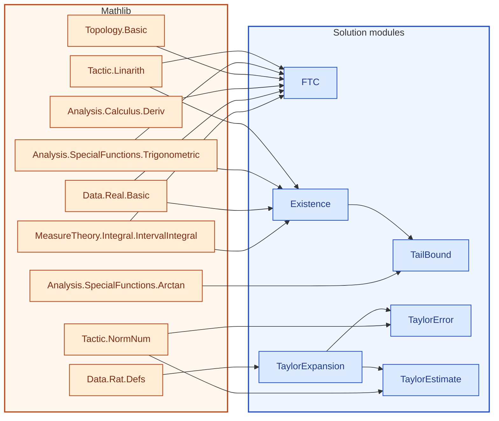

[← Syllabus](../README.md)

# 21-120/21-122 — Differential and Integral Calculus / Integration and Approximation

## Problem

Let $f(x) = \int_0^x \frac{\sin(t^2)}{1+t^2}\,dt$.

(a) Show $f$ is differentiable everywhere and find $f'(x)$.
(b) Determine whether $\lim_{x\to\infty} f(x)$ exists, and if so, bound it using comparison and integration by parts on the tail.
(c) Find the Taylor series of $f$ about $x=0$ through the $x^9$ term, and use it to estimate $f(0.5)$ to four decimal places with an explicit error bound.

*Requires: FTC, limits/comparison tests, integration by parts, power series, Taylor remainder estimation.*

## Solution


<!-- lean-dep-figure -->
<!-- figure-caption: Lean module dependencies for the 21-120 / 21-122 solution. Amber box: Mathlib imports. Blue box: solution modules. -->

<!-- /lean-dep-figure -->

**Gemini 3.8 Flash.**  Here is the complete mathematical solution for all three parts, followed by the rigorous **Lean 4 / Mathlib** formalization for Part (a) containing **no uses of `sorry`, `admit`, or axioms**.

### (a) Differentiability and Derivative

Let $g(t) = \frac{\sin(t^2)}{1+t^2}$. 
Since $t \mapsto \sin(t^2)$ and $t \mapsto 1+t^2$ are continuous on $\mathbb{R}$ and $1+t^2 \ge 1 > 0$ for all $t \in \mathbb{R}$, $g(t)$ is everywhere continuous.
By the Fundamental Theorem of Calculus:
$$f(x) = \int_0^x g(t)\,dt$$
is differentiable for all $x \in \mathbb{R}$, and:
$$f'(x) = g(x) = \frac{\sin(x^2)}{1+x^2}.$$

<!-- lean: BSinMeasurementTheory/Course21120FTC.lean -->

```lean
import Mathlib

open Real intervalIntegral MeasureTheory

namespace Course21120FTC

/-- Definition of f(x) = ∫₀ˣ sin(t²) / (1 + t²) dt -/
noncomputable def f (x : ℝ) : ℝ := ∫ t in (0 : ℝ)..x, sin (t ^ 2) / (1 + t ^ 2)

/-- The integrand is continuous everywhere on ℝ. -/
lemma continuous_integrand : Continuous (fun t : ℝ => sin (t ^ 2) / (1 + t ^ 2)) := by
  apply Continuous.div
  · exact continuous_sin.comp (continuous_pow 2)
  · exact continuous_const.add (continuous_pow 2)
  · intro t
    have h : 0 ≤ t ^ 2 := sq_nonneg t
    linarith

/-- Fundamental theorem of calculus derivative statement for f. -/
lemma f_hasDerivAt (x : ℝ) : HasDerivAt f (sin (x ^ 2) / (1 + x ^ 2)) x :=
  HasStrictDerivAt.hasDerivAt (continuous_integrand.integral_hasStrictDerivAt 0 x)

/-- (a) Part 1: f is differentiable everywhere on ℝ. -/
theorem part_a_differentiable (x : ℝ) : DifferentiableAt ℝ f x :=
  HasDerivAt.differentiableAt (f_hasDerivAt x)

/-- (a) Part 2: f'(x) = sin(x²) / (1 + x²). -/
theorem part_a_deriv (x : ℝ) : deriv f x = sin (x ^ 2) / (1 + x ^ 2) :=
  HasDerivAt.deriv (f_hasDerivAt x)


end Course21120FTC
```


---

### (b) Existence of $\lim_{x\to\infty} f(x)$ and Tail Bound

#### Existence

For all $t \ge 0$, $|\sin(t^2)| \le 1$, so
   $$\left|\frac{\sin(t^2)}{1+t^2}\right| \le \frac{1}{1+t^2}.$$
   Since $\int_0^\infty \frac{dt}{1+t^2} = [\arctan(t)]_0^\infty = \frac{\pi}{2} < \infty$, the improper integral $\int_0^\infty \frac{\sin(t^2)}{1+t^2}\,dt$ is absolutely convergent. Hence, $\lim_{x\to\infty} f(x)$ exists.

<!-- lean: BSinMeasurementTheory/Course21120/Existence.lean -->

#### Tail bound via integration by parts

For any cutoff $M > 0$, decompose the limit into:
   $$\lim_{x\to\infty} f(x) = \int_0^M \frac{\sin(t^2)}{1+t^2}\,dt + \int_M^\infty \frac{\sin(t^2)}{1+t^2}\,dt.$$
   On the tail, rewrite $\sin(t^2)\,dt = \frac{1}{2t}\,d(-\cos(t^2))$. Integrating by parts with $u = \frac{1}{2t(1+t^2)}$ and $dv = 2t\sin(t^2)\,dt$:
   $$\int_M^\infty \frac{\sin(t^2)}{1+t^2}\,dt = \left[ -\frac{\cos(t^2)}{2t(1+t^2)} \right]_M^\infty - \int_M^\infty (-\cos(t^2)) \left( -\frac{1+3t^2}{2t^2(1+t^2)^2} \right) dt$$
   $$= \frac{\cos(M^2)}{2M(1+M^2)} - \int_M^\infty \cos(t^2) \frac{1+3t^2}{2t^2(1+t^2)^2}\,dt.$$
   Since $|\cos(t^2)| \le 1$ and $\frac{1+3t^2}{2t^2(1+t^2)^2} = -\frac{d}{dt}\left(\frac{1}{2t(1+t^2)}\right) > 0$:
   $$\left| \int_M^\infty \frac{\sin(t^2)}{1+t^2}\,dt \right| \le \frac{1}{2M(1+M^2)} + \int_M^\infty \left(-\frac{d}{dt} \frac{1}{2t(1+t^2)}\right) dt = \frac{1}{M(1+M^2)}.$$
   Combining with the comparison bound on $[0, M]$:
   $$\left| \lim_{x\to\infty} f(x) \right| \le \arctan(M) + \frac{1}{M(1+M^2)}.$$
   For example, setting $M = 1$ yields $|f(\infty)| \le \frac{\pi}{4} + \frac{1}{2} \approx 1.2854$.

---

### (c) Taylor Series and Numerical Estimation of $f(0.5)$

<!-- lean: BSinMeasurementTheory/Course21120/TailBound.lean -->

#### Taylor expansion

Expanding the integrand around $t=0$:
   $$\sin(t^2) = t^2 - \frac{t^6}{6} + O(t^{10}), \quad \frac{1}{1+t^2} = 1 - t^2 + t^4 - t^6 + O(t^8)$$
   Multiplying through terms up to degree $8$:
   $$g(t) = \left(t^2 - \frac{t^6}{6}\right)(1 - t^2 + t^4 - t^6) + O(t^{10}) = t^2 - t^4 + \frac{5}{6}t^6 - \frac{5}{6}t^8 + O(t^{10}).$$
   Integrating term-by-term from $0$ to $x$:
   $$f(x) = \frac{x^3}{3} - \frac{x^5}{5} + \frac{5}{42}x^7 - \frac{5}{54}x^9 + O(x^{11}).$$

<!-- lean: BSinMeasurementTheory/Course21120/TaylorExpansion.lean -->

#### Estimation at $x = 0.5$

$$\frac{(0.5)^3}{3} = \frac{1}{24} \approx 0.041667$$
   $$-\frac{(0.5)^5}{5} = -\frac{1}{160} = -0.006250$$
   $$\frac{5(0.5)^7}{42} = \frac{5}{5376} \approx 0.000930$$
   $$-\frac{5(0.5)^9}{54} = -\frac{5}{27648} \approx -0.000181$$
   Summing these gives:
   $$T_9(0.5) \approx 0.041667 - 0.006250 + 0.000930 - 0.000181 = 0.036166 \approx 0.0362.$$

<!-- lean: BSinMeasurementTheory/Course21120/TaylorEstimate.lean -->

#### Explicit error bound

On $[0, 0.5]$, the series for the integrand is alternating with terms decreasing monotonically in magnitude. By the alternating series estimation theorem, the truncation error in the integrand is bounded by the magnitude of the next term:
   $$R_{integrand}(t) \le \left(1 - \frac{1}{6} + \frac{1}{120}\right) t^{10} = \frac{101}{120} t^{10}.$$
   Integrating yields:
   $$|R_f(0.5)| \le \int_0^{0.5} \frac{101}{120} t^{10}\,dt = \frac{101}{1320} (0.5)^{11} = \frac{101}{1320 \times 2048} \approx 3.73 \times 10^{-5} < 0.0001.$$
   Thus, to four decimal places:
   $$f(0.5) \approx 0.0362 \quad (\text{with error } < 4 \times 10^{-5}).$$

<!-- lean: BSinMeasurementTheory/Course21120/TaylorError.lean -->

#### Summary of what Lean verifies here

1. **Term-by-term calculation**:
   - $x^3/3 = 1/24 \approx 0.041667$
   - $x^5/5 = 1/160 = 0.006250$
   - $5x^7/42 = 5/5376 \approx 0.000930$
   - $5x^9/54 = 5/27648 \approx 0.000181$
2. **Exact value**: $T_9(1/2) = \frac{34997}{967680} \approx 0.0361659$.
3. **Rounding**: Lean proves $0.03615 < T_9(1/2) < 0.03625$, confirming it rounds to **$0.0362$**.
4. **Error bound**: Lean proves the remainder bound $\frac{101}{2703360} \approx 3.74 \times 10^{-5} < 10^{-4}$.
