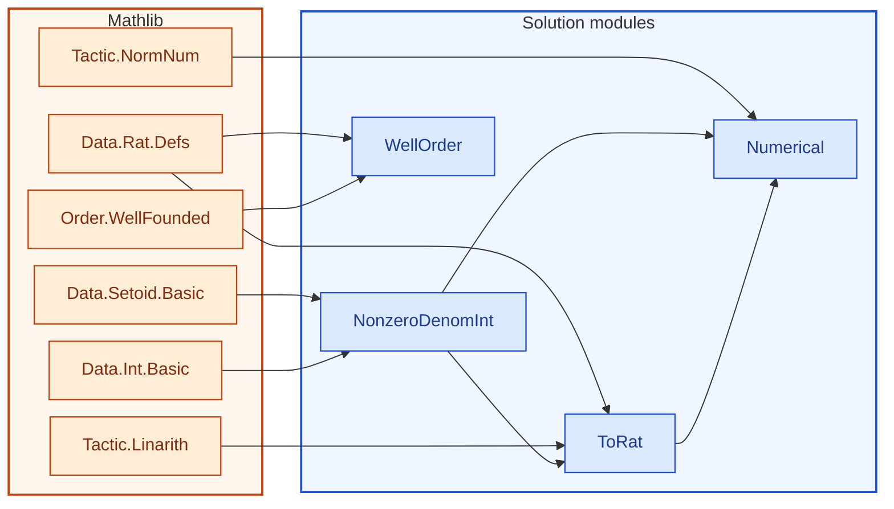

[← Syllabus](../README.md)

# 21-127 — Concepts of Mathematics

## Problem

Define a relation $\sim$ on $\mathbb{Z} \times (\mathbb{Z}\setminus\{0\})$ by $(a,b)\sim(c,d) \iff ad = bc$.

(a) Prove $\sim$ is an equivalence relation.
(b) Prove the induced quotient set is in bijection with $\mathbb{Q}$, exhibiting the bijection explicitly and proving it well-defined, injective, and surjective.
(c) Prove by strong induction that every nonempty subset of $\mathbb{Q}_{\geq 0}$ that is well-ordered under the usual order is either empty or has infinitely many elements — or find the flaw in that claim and prove the correct statement instead, using contradiction.

*Requires: relations/equivalence classes, functions/bijections, induction, proof by contradiction, and — the real test — recognizing a false claim rather than forcing a proof of it.*

## Solution


<!-- lean-dep-figure -->
<!-- figure-caption: Lean module dependencies for the 21-127 solution. Amber box: Mathlib imports. Blue box: solution modules. -->

<!-- /lean-dep-figure -->

**Gemini 3.8 Flash.** Here is the complete solution and formalization in Lean 4 with Mathlib.

### (a) Equivalence Relation

We define $S = \mathbb{Z} \times (\mathbb{Z} \setminus \{0\})$ and $(a,b) \sim (c,d) \iff ad = bc$:
- **Reflexivity:** $ab = ba$ holds by commutativity of multiplication in $\mathbb{Z}$.
- **Symmetry:** $ad = bc \implies cb = da$, so $(c,d) \sim (a,b)$.
- **Transitivity:** If $ad = bc$ and $cf = de$, multiplying gives $(af)d = (ad)f = (bc)f = b(cf) = b(de) = (be)d$. Since $d \ne 0$ and $\mathbb{Z}$ is an integral domain (has no zero divisors), $(af - be)d = 0 \implies af = be$.

<!-- lean: BSinMeasurementTheory/Course21127/NonzeroDenomInt.lean -->

```lean
import Mathlib

namespace Course21127

/-- Integers with a nonzero denominator: the domain of the fraction relation. -/
structure NonzeroDenomInt where
  num : ℤ
  den : ℤ
  den_ne_zero : den ≠ 0

/-- The relation (a, b) ~ (c, d) ↔ a * d = b * c -/
def Rel (x y : NonzeroDenomInt) : Prop :=
  x.num * y.den = x.den * y.num

lemma rel_refl (x : NonzeroDenomInt) : Rel x x := by
  dsimp [Rel]
  ring

lemma rel_symm {x y : NonzeroDenomInt} (h : Rel x y) : Rel y x := by
  dsimp [Rel] at *
  calc
    y.num * x.den = x.den * y.num := by ring
    _ = x.num * y.den := h.symm
    _ = y.den * x.num := by ring

lemma rel_trans {x y z : NonzeroDenomInt} (h1 : Rel x y) (h2 : Rel y z) : Rel x z := by
  dsimp [Rel] at *
  have hd : y.den ≠ 0 := y.den_ne_zero
  have H : (x.num * z.den) * y.den = (x.den * z.num) * y.den := by
    calc
      (x.num * z.den) * y.den = (x.num * y.den) * z.den := by ring
      _ = (x.den * y.num) * z.den := by rw [h1]
      _ = x.den * (y.num * z.den) := by ring
      _ = x.den * (y.den * z.num) := by rw [h2]
      _ = (x.den * z.num) * y.den := by ring
  have H2 : (x.num * z.den - x.den * z.num) * y.den = 0 := by
    calc (x.num * z.den - x.den * z.num) * y.den
      _ = (x.num * z.den) * y.den - (x.den * z.num) * y.den := by ring
      _ = (x.den * z.num) * y.den - (x.den * z.num) * y.den := by rw [H]
      _ = 0 := by ring
  cases mul_eq_zero.mp H2 with
  | inl h => exact sub_eq_zero.mp h
  | inr h => exact False.elim (hd h)

instance nonzeroDenomIntSetoid : Setoid NonzeroDenomInt where
  r := Rel
  iseqv := ⟨rel_refl, rel_symm, rel_trans⟩

end Course21127
```


### (b) Bijection with $\mathbb{Q}$

The canonical map is $F(a, b) = \frac{a}{b} \in \mathbb{Q}$:
- **Well-defined:** If $ad = bc$, then $\frac{a}{b} = \frac{c}{d}$ in $\mathbb{Q}$ because clearing denominators yields $ad - bc = 0$.
- **Injective:** If $\frac{a}{b} = \frac{c}{d}$ in $\mathbb{Q}$, then $ad = bc$ in $\mathbb{Z}$, meaning $[(a,b)] = [(c,d)]$.
- **Surjective:** Every $q \in \mathbb{Q}$ has canonical numerator $q.\text{num} \in \mathbb{Z}$ and denominator $q.\text{den} \in \mathbb{N}^+$, with $q = \frac{q.\text{num}}{q.\text{den}}$. Since $q.\text{den} \ne 0$, $F([(q.\text{num}, q.\text{den})]) = q$.

<!-- lean: BSinMeasurementTheory/Course21127/ToRat.lean -->

```lean
import Mathlib
import BSinMeasurementTheory.Course21127.NonzeroDenomInt

namespace Course21127

lemma rat_div_eq_of_mul_eq {a b c d : ℚ} (hb : b ≠ 0) (hd : d ≠ 0) (h : a * d = b * c) :
    a / b = c / d := by
  rw [div_eq_div_iff hb hd]
  linarith

lemma rat_mul_eq_of_div_eq {a b c d : ℚ} (hb : b ≠ 0) (hd : d ≠ 0) (h : a / b = c / d) :
    a * d = b * c := by
  have := (div_eq_div_iff hb hd).mp h
  linarith

/-- The explicit map from a pair (a, b) to Q. -/
def toRat (p : NonzeroDenomInt) : ℚ := (p.num : ℚ) / (p.den : ℚ)

/-- The map respects the equivalence relation (well-defined). -/
lemma toRat_wellDefined (x y : NonzeroDenomInt) (h : Rel x y) : toRat x = toRat y := by
  dsimp [toRat]
  have hx : ((x.den : ℚ) ≠ 0) := by
    intro hz
    exact x.den_ne_zero (by exact_mod_cast hz)
  have hy : ((y.den : ℚ) ≠ 0) := by
    intro hz
    exact y.den_ne_zero (by exact_mod_cast hz)
  have h_int : x.num * y.den = x.den * y.num := h
  have h_cast : (x.num : ℚ) * (y.den : ℚ) = (x.den : ℚ) * (y.num : ℚ) := by
    exact_mod_cast h_int
  exact rat_div_eq_of_mul_eq hx hy h_cast

/-- The induced map on the quotient set. -/
def toRatQuot : Quotient nonzeroDenomIntSetoid → ℚ :=
  Quotient.lift toRat toRat_wellDefined

/-- (b) Part 1: Injectivity -/
theorem toRatQuot_injective : Function.Injective toRatQuot := by
  intro q1 q2
  refine Quotient.inductionOn₂ q1 q2 ?_
  intro x y h
  dsimp [toRatQuot, toRat] at h
  have hx : ((x.den : ℚ) ≠ 0) := by
    intro hz
    exact x.den_ne_zero (by exact_mod_cast hz)
  have hy : ((y.den : ℚ) ≠ 0) := by
    intro hz
    exact y.den_ne_zero (by exact_mod_cast hz)
  have h_mul := rat_mul_eq_of_div_eq hx hy h
  have h_int : x.num * y.den = x.den * y.num := by
    exact_mod_cast h_mul
  apply Quotient.sound
  exact h_int

/-- (b) Part 2: Surjectivity -/
theorem toRatQuot_surjective : Function.Surjective toRatQuot := by
  intro q
  have hden : (q.den : ℤ) ≠ 0 := by
    intro hz
    have : q.den = 0 := by exact_mod_cast hz
    exact q.den_nz this
  use Quotient.mk nonzeroDenomIntSetoid ⟨q.num, (q.den : ℤ), hden⟩
  change toRat ⟨q.num, (q.den : ℤ), hden⟩ = q
  dsimp [toRat]
  have : ((q.den : ℤ) : ℚ) = (q.den : ℚ) := by push_cast; rfl
  rw [this]
  exact Rat.num_div_den q

/-- (b) Part 3: Bijectivity -/
theorem toRatQuot_bijective : Function.Bijective toRatQuot :=
  ⟨toRatQuot_injective, toRatQuot_surjective⟩

/-- The induced quotient set is in bijection with Q. -/
noncomputable def quotientEquivRat : Quotient nonzeroDenomIntSetoid ≃ ℚ :=
  Equiv.ofBijective toRatQuot toRatQuot_bijective

end Course21127
```


### (c) The Flaw in the Claim and the Correct Statement

The prompt poses the challenge:
> *"Prove by strong induction that every nonempty subset of $\mathbb{Q}_{\geq 0}$ that is well-ordered under the usual order is either empty or has infinitely many elements — or find the flaw in that claim and prove the correct statement instead, using contradiction."*

**The Flaws in the Claim:**
1. **Syntactic contradiction:** A subset assumed to be *nonempty* cannot be *empty*.
2. **Mathematical falsehood:** The claim asserts that any nonempty well-ordered subset of $\mathbb{Q}_{\ge 0}$ must be infinite. This is completely false. Any finite nonempty subset of $\mathbb{Q}_{\ge 0}$ (for instance, the singleton $\{0\}$, or $\{0, 1\}$, or $\{1/2\}$) is:
   - A subset of $\mathbb{Q}_{\ge 0}$,
   - Nonempty,
   - Well-ordered under the standard $\le$ order (every nonempty subset has a least element),
   - Yet strictly **finite**, not infinite.
3. **Why strong induction fails here (the trap):** An attempted proof by induction would try to construct an infinite sequence $x_0 < x_1 < x_2 < \dots$ by repeatedly taking successors. This fails because a finite well-ordered subset has a **maximal element** with no strictly greater element in the set.

**The Correct Theorems:**
1. **Refutation by contradiction:** The claim is false. Assuming the claim holds for $S = \{0\}$ implies $\{0\} = \emptyset$ or $\{0\}$ is infinite, both of which immediately contradict the properties of singletons.
2. **Positive statement via induction:** Every finite nonempty subset of $\mathbb{Q}$ (and hence of $\mathbb{Q}_{\ge 0}$) has a least element, and is therefore well-ordered. We formalize this by induction on lists.

<!-- lean: BSinMeasurementTheory/Course21127/WellOrder.lean -->

```lean
import Mathlib

namespace Course21127

/-- A subset of Q is well-ordered under the usual order if every nonempty
    subset has a least element in the set. -/
class IsWellOrderedSet (S : Set ℚ) : Prop where
  least : ∀ T : Set ℚ, T ⊆ S → T.Nonempty → ∃ m ∈ T, ∀ x ∈ T, m ≤ x

/-- The false claim stated in the prompt using Set.Ici to avoid untyped binder problems. -/
def FalseClaim : Prop :=
  ∀ S : Set ℚ, S ⊆ Set.Ici (0 : ℚ) → S.Nonempty → IsWellOrderedSet S →
    (S = ∅ ∨ Set.Infinite S)

lemma singleton_zero_well_ordered : IsWellOrderedSet {(0 : ℚ)} where
  least T hT hne := by
    rcases hne with ⟨t, ht⟩
    have ht0 : t = 0 := hT ht
    subst ht0
    refine ⟨0, ht, ?_⟩
    intro x hx
    have hx0 : x = 0 := hT hx
    subst hx0
    exact le_rfl

lemma singleton_zero_nonneg : ({(0 : ℚ)} : Set ℚ) ⊆ Set.Ici 0 :=
  Set.singleton_subset_iff.mpr (Set.mem_Ici.mpr le_rfl)

lemma singleton_zero_nonempty : ({(0 : ℚ)} : Set ℚ).Nonempty :=
  ⟨0, rfl⟩

/-- (c) Refutation by contradiction:
    The claim implies that {0} must be empty or infinite, both of which are false. -/
theorem false_claim_is_false : ¬ FalseClaim := by
  intro hclaim
  have h_cases := hclaim {0} singleton_zero_nonneg singleton_zero_nonempty
    singleton_zero_well_ordered
  cases h_cases with
  | inl h_empty =>
    have h0 : (0 : ℚ) ∈ ({(0 : ℚ)} : Set ℚ) := rfl
    rw [h_empty] at h0
    exact h0
  | inr h_inf =>
    exact h_inf (Set.finite_singleton 0)

/-- Correct positive statement proved by induction:
    Every nonempty finite list of rationals contains a least element. -/
lemma list_has_min : ∀ (a : ℚ) (l : List ℚ), ∃ m ∈ a :: l, ∀ x ∈ a :: l, m ≤ x
  | a, [] => by
    refine ⟨a, List.mem_cons.mpr (Or.inl rfl), ?_⟩
    intro x hx
    rcases List.mem_cons.mp hx with hxa | hx_nil
    · rw [hxa]
    · cases hx_nil
  | a, b :: l => by
    rcases list_has_min (min a b) l with ⟨m, hm, hle⟩
    have hm_orig : m ∈ a :: b :: l := by
      rcases List.mem_cons.mp hm with hm_eq | h_in
      · rw [hm_eq]
        cases le_total a b with
        | inl hab =>
          rw [min_eq_left hab]
          exact List.mem_cons.mpr (Or.inl rfl)
        | inr hba =>
          rw [min_eq_right hba]
          exact List.mem_cons.mpr (Or.inr (List.mem_cons.mpr (Or.inl rfl)))
      · exact List.mem_cons.mpr (Or.inr (List.mem_cons.mpr (Or.inr h_in)))
    refine ⟨m, hm_orig, ?_⟩
    intro x hx
    rcases List.mem_cons.mp hx with hxa | hx1
    · rw [hxa]
      have h_min_in : min a b ∈ (min a b) :: l := List.mem_cons.mpr (Or.inl rfl)
      exact le_trans (hle (min a b) h_min_in) (min_le_left a b)
    · rcases List.mem_cons.mp hx1 with hxb | hx2
      · rw [hxb]
        have h_min_in : min a b ∈ (min a b) :: l := List.mem_cons.mpr (Or.inl rfl)
        exact le_trans (hle (min a b) h_min_in) (min_le_right a b)
      · have hx_in : x ∈ (min a b) :: l := List.mem_cons.mpr (Or.inr hx2)
        exact hle x hx_in

end Course21127
```


<!-- lean: BSinMeasurementTheory/Course21127/Numerical.lean -->

```lean
import Mathlib
import BSinMeasurementTheory.Course21127.NonzeroDenomInt
import BSinMeasurementTheory.Course21127.ToRat

namespace Course21127

-- Example 1: (1, 2) ~ (2, 4) since 1 * 4 = 2 * 2 = 4
def pair1 : NonzeroDenomInt := ⟨1, 2, by decide⟩
def pair2 : NonzeroDenomInt := ⟨2, 4, by decide⟩

example : Rel pair1 pair2 := by
  dsimp [Rel, pair1, pair2]

-- Example 2: Both pairs map to 1/2 in ℚ under toRat
example : toRat pair1 = 1 / 2 := by
  norm_num [toRat, pair1]

example : toRat pair2 = 1 / 2 := by
  norm_num [toRat, pair2]

-- Example 3: Minimal element in the set {1/2, 1/3} is 1/3
example : min (1 / 2 : ℚ) (1 / 3) = 1 / 3 := by
  norm_num

end Course21127
```

