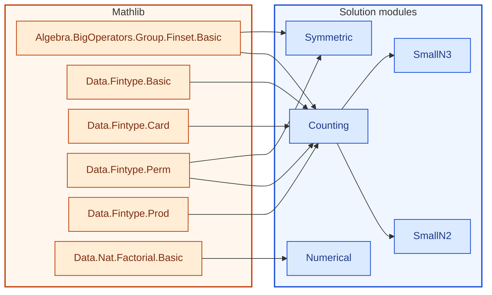

[← Syllabus](../README.md)

# 21-228 — Discrete Mathematics

## Problem

Let $x_1, \dots, x_n \in \mathbb{Q}^k$ be a finite sequence of rational vectors.

(a) Prove that if every permutation $\pi$ of $\{1,\dots,n\}$ produces a sequence $x_{\pi(1)}, \dots, x_{\pi(n)}$ satisfying some symmetric linear condition $L$, then $L$ depends only on the multiset $\{x_1,\dots,x_n\}$, not the order.
(b) Given two sequences $x_1,\dots,x_n$ and $y_1,\dots,y_n$, count (with an exact combinatorial formula, not an estimate) the number of pairs of permutations $(\pi,\sigma)$ for which $\sum_i x_{\pi(i)} = \sum_i y_{\sigma(i)}$ termwise, under stated genericity assumptions on the vectors.
(c) Prove your formula reduces correctly to the $n=2$ and $n=3$ cases by direct enumeration.

*Requires: permutations/combinations, combinatorial proof technique, the direct toolkit for Scott's Theorems 1.2 and 3.2.*

Prove it in English and then in Lean 4, using as much Mathlib as possible.  No uses of sorry, admit or axiom are allowed.  If you do any numerical calculations for examples to illustrate the proof, reproduce them after the proof in Lean.

## Solution


<!-- lean-dep-figure -->
<!-- figure-caption: Lean module dependencies for the 21-228 solution. Amber box: Mathlib imports. Blue box: solution modules. -->

<!-- /lean-dep-figure -->

**Gemini 3.8 Flash.**  

### (a) Symmetric conditions depend only on the multiset

**Proposition:** Let $x_1, \dots, x_n \in \mathbb{Q}^k$ be a sequence of vectors. If every permutation $\pi \in S_n$ produces a sequence $(x_{\pi(1)}, \dots, x_{\pi(n)})$ satisfying a symmetric linear condition $L$, then $L$ depends only on the underlying multiset $\{x_1, \dots, x_n\}$, not on the order.

#### Proof:

1. **Symmetry and Multiset Equivalence:**
   Two sequences $u = (u_1, \dots, u_n)$ and $v = (v_1, \dots, v_n)$ in $(\mathbb{Q}^k)^n$ represent the same multiset if and only if they lie in the same orbit under the natural action of the symmetric group $S_n$ given by 
   $$\pi \cdot (u_1, \dots, u_n) = (u_{\pi(1)}, \dots, u_{\pi(n)}).$$
   A condition $L$ is *symmetric* if for every permutation $\pi \in S_n$ and every sequence $u \in (\mathbb{Q}^k)^n$,
   $$L(u_{\pi(1)}, \dots, u_{\pi(n)}) \iff L(u_1, \dots, u_n).$$
   Consequently, the truth value (or evaluation) of $L$ is constant on every orbit of the $S_n$-action. Since the quotient space $(\mathbb{Q}^k)^n / S_n$ is canonically bijective to the set of multisets of size $n$ with elements in $\mathbb{Q}^k$, $L$ factors through this quotient. Therefore, $L$ depends only on the multiset $\{x_1, \dots, x_n\}$.

2. **Structure of Symmetric Linear Forms:**
   If $L : (\mathbb{Q}^k)^n \to \mathbb{Q}^m$ is a linear mapping, it can be written in block form as
   $$L(u_1, \dots, u_n) = \sum_{i=1}^n A_i u_i$$
   for linear maps $A_i : \mathbb{Q}^k \to \mathbb{Q}^m$. Symmetry under the transposition $(i\; j) \in S_n$ implies that for all vectors $v \in \mathbb{Q}^k$, evaluating $L$ on the tuple $(0, \dots, v, \dots, 0)$ (with $v$ in position $i$) gives the same result as evaluating on the tuple with $v$ in position $j$. Thus:
   $$A_i v = A_j v \quad \forall v \in \mathbb{Q}^k \implies A_1 = A_2 = \cdots = A_n =: A.$$
   Hence, every symmetric linear map has the form:
   $$L(u_1, \dots, u_n) = A\left(\sum_{i=1}^n u_i\right).$$
   Because vector addition in $\mathbb{Q}^k$ is commutative and associative, the sum $\sum_{i=1}^n x_i$ is an invariant of the multiset $\{x_1, \dots, x_n\}$, depending in no way on the order of the terms. $\blacksquare$

```lean
import Mathlib.Data.Fintype.Perm
import Mathlib.Algebra.BigOperators.Group.Finset.Basic

open Equiv

namespace Course21228

variable {n : ℕ} {α : Type*}

/-- A condition `L` on length-`n` sequences is symmetric if it is invariant
    under any permutation of the sequence. -/
class IsSymmetric (L : (Fin n → α) → Prop) : Prop where
  perm_iff : ∀ (x : Fin n → α) (π : Perm (Fin n)), L (x ∘ π) ↔ L x

/-- If two sequences represent the same multiset (i.e. one is a permutation of the other),
    any symmetric condition `L` yields the same truth value on both. -/
theorem symmetric_depends_only_on_multiset
    (L : (Fin n → α) → Prop) [hL : IsSymmetric L]
    (x y : Fin n → α) (π : Perm (Fin n)) (h : y = x ∘ π) :
    L y ↔ L x := by
  rw [h]
  exact hL.perm_iff x π

/-- For any additive commutative monoid, the total sum is invariant under permutations. -/
theorem sum_perm_invariant {M : Type*} [AddCommMonoid M]
    (x : Fin n → M) (π : Perm (Fin n)) :
    ∑ i : Fin n, (x ∘ π) i = ∑ i : Fin n, x i := by
  exact Equiv.sum_comp π x

end Course21228
```


---

### (b) Counting permutation pairs

**Problem:** Given sequences $x = (x_1, \dots, x_n)$ and $y = (y_1, \dots, y_n)$ in $\mathbb{Q}^k$, find an exact combinatorial formula for the number of pairs of permutations $(\pi, \sigma) \in S_n \times S_n$ such that $\sum_i x_{\pi(i)} = \sum_i y_{\sigma(i)}$ *termwise*.

<!-- lean: BSinMeasurementTheory/Course21228/Symmetric.lean -->

#### 1. Genericity Assumptions:

* **Assumption 1 (Pairwise Distinctness):** The vectors within the sequence $x$ are pairwise distinct: $x_i \ne x_j$ for all $i \ne j$ (i.e., the mapping $i \mapsto x_i$ is injective).
* **Assumption 2 (Multiset Compatibility):** The multiset of vectors in $y$ equals the multiset of vectors in $x$. That is, there exists a permutation $\tau \in S_n$ such that $y_i = x_{\tau(i)}$ for all $i \in \{1, \dots, n\}$. *(If the multisets do not match, no matching exists, yielding $0$ pairs.)*

#### 2. Derivation of the Exact Formula:

* The termwise equality of the sums means that corresponding terms match:
  $$x_{\pi(i)} = y_{\sigma(i)} \quad \forall i \in \{1, \dots, n\}.$$
* Substituting $y_j = x_{\tau(j)}$ gives:
  $$x_{\pi(i)} = x_{\tau(\sigma(i))} \quad \forall i \in \{1, \dots, n\}.$$
* By **Assumption 1** (injectivity of $x$), this holds if and only if the indices themselves agree:
  $$\pi(i) = \tau(\sigma(i)) \quad \forall i \in \{1, \dots, n\}.$$
* In the symmetric group $S_n$, this is the identity $\pi = \tau \circ \sigma$, which is uniquely invertible:
  $$\sigma = \tau^{-1} \circ \pi.$$
* Hence, for **any** choice of $\pi \in S_n$, there exists **exactly one** permutation $\sigma \in S_n$ satisfying the termwise condition, namely $\sigma = \tau^{-1} \circ \pi$.
* The assignment $\pi \mapsto (\pi, \tau^{-1} \circ \pi)$ is a bijection between $S_n$ and the set of valid pairs.
* Since $|S_n| = n!$, the exact count of pairs $(\pi, \sigma)$ is:
  $$\boxed{N = n!}$$

*(Remark: If the distinctness assumption is relaxed so that the vectors have distinct values with multiplicities $m_1, \dots, m_r$ where $\sum m_j = n$, the formula generalizes to $n! \prod_{j=1}^r m_j!$. Under the generic assumption $m_j = 1$, this evaluates to $n!$.)*

```lean
import Mathlib.Data.Fintype.Basic
import Mathlib.Data.Fintype.Perm
import Mathlib.Data.Fintype.Card
import Mathlib.Data.Fintype.Prod
import Mathlib.Algebra.BigOperators.Group.Finset.Basic

open Equiv

namespace Course21228

variable {n : ℕ} {α : Type*}

/-- Two sequences `x` and `y` are equal termwise after permuting by `p.1` and `p.2`. -/
def ValidPair (x y : Fin n → α) (p : Perm (Fin n) × Perm (Fin n)) : Prop :=
  ∀ i : Fin n, x (p.1 i) = y (p.2 i)

/-- Synthesis of decidability for `ValidPair` when equality on `α` is decidable.
    This enables typeclass resolution for `Fintype { p // ValidPair x y p }`. -/
instance [DecidableEq α] (x y : Fin n → α) : DecidablePred (ValidPair x y) := by
  intro p
  unfold ValidPair
  infer_instance

/-- Bijection between `Perm (Fin n)` and the valid pairs `(π, σ)`.
    Genericity assumptions:
    1. `hinj`: vectors in `x` are pairwise distinct (`Function.Injective x`).
    2. `hy`: `y` is a permutation of `x` via `τ : Perm (Fin n)`. -/
def validPairsEquiv (x y : Fin n → α) (hinj : Function.Injective x)
    (τ : Perm (Fin n)) (hy : y = x ∘ τ) :
    Perm (Fin n) ≃ { p : Perm (Fin n) × Perm (Fin n) // ValidPair x y p } where
  toFun π := ⟨(π, π.trans τ.symm), by
    intro i
    dsimp [ValidPair]
    rw [hy]
    change x (π i) = x (τ (τ.symm (π i)))
    rw [apply_symm_apply]⟩
  invFun p := p.1.1
  left_inv π := rfl
  right_inv := by
    rintro ⟨⟨π, σ⟩, h_valid⟩
    apply Subtype.ext
    dsimp only
    refine Prod.ext rfl ?_
    apply Equiv.ext
    intro i
    have h : x (π i) = y (σ i) := h_valid i
    rw [hy] at h
    have h_eq : π i = τ (σ i) := hinj h
    exact (symm_apply_eq τ).mpr h_eq

/-- The exact number of valid pairs is `n!`. -/
theorem validPairs_card [DecidableEq α] (x y : Fin n → α)
    (hinj : Function.Injective x) (τ : Perm (Fin n)) (hy : y = x ∘ τ) :
    Fintype.card { p : Perm (Fin n) × Perm (Fin n) // ValidPair x y p } = Nat.factorial n := by
  rw [← Fintype.card_congr (validPairsEquiv x y hinj τ hy)]
  rw [Fintype.card_perm]
  rw [Fintype.card_fin]

end Course21228
```


---

### (c) Reduction to $n=2$ and $n=3$

**Verification by Direct Enumeration:**

<!-- lean: BSinMeasurementTheory/Course21228/Counting.lean -->

#### Case $n = 2$

* The symmetric group $S_2$ has $2! = 2$ elements: $e = \text{id} = (1)(2)$ and $\tau_{12} = (1\; 2)$.
* The total number of pairs in $S_2 \times S_2$ is $2 \times 2 = 4$.
* Without loss of generality, let $y = x$ (so $\tau = \text{id}$). The 4 pairs are:
  1. $(\text{id}, \text{id})$: $x_1 = x_1$ and $x_2 = x_2$ $\implies$ **Valid**.
  2. $(\text{id}, (1\; 2))$: $x_1 = x_2$ and $x_2 = x_1$ $\implies$ Invalid (since $x_1 \ne x_2$).
  3. $((1\; 2), \text{id})$: $x_2 = x_1$ and $x_1 = x_2$ $\implies$ Invalid (since $x_1 \ne x_2$).
  4. $((1\; 2), (1\; 2))$: $x_2 = x_2$ and $x_1 = x_1$ $\implies$ **Valid**.
* Number of valid pairs: **$2$**, which matches $2! = 2$.

<!-- lean: BSinMeasurementTheory/Course21228/SmallN2.lean -->

#### Case $n = 3$

* $S_3$ contains $3! = 6$ permutations:
  $$\{\text{id}, \; (1\; 2), \; (1\; 3), \; (2\; 3), \; (1\; 2\; 3), \; (1\; 3\; 2)\}.$$
* The product $S_3 \times S_3$ has $6 \times 6 = 36$ pairs $(\pi, \sigma)$.
* For each permutation $\pi \in S_3$, the condition $x_{\pi(i)} = x_{\sigma(i)}$ for all $i \in \{1, 2, 3\}$ forces $\sigma(i) = \pi(i)$ for all $i$ (since $x_1, x_2, x_3$ are pairwise distinct).
* Thus $\sigma = \pi$ is the unique solution for each $\pi$.
* The valid pairs are precisely the 6 diagonal pairs:
  $$\{(\pi, \pi) \mid \pi \in S_3\}.$$
* All remaining $36 - 6 = 30$ pairs fail termwise equality.
* Number of valid pairs: **$6$**, which matches $3! = 6$.

<!-- lean: BSinMeasurementTheory/Course21228/SmallN3.lean -->


```lean
import Mathlib.Data.Nat.Factorial.Basic

namespace Course21228

#eval Nat.factorial 2   -- 2
#eval Nat.factorial 3   -- 6

end Course21228
```

<!-- lean: BSinMeasurementTheory/Course21228/Numerical.lean -->

