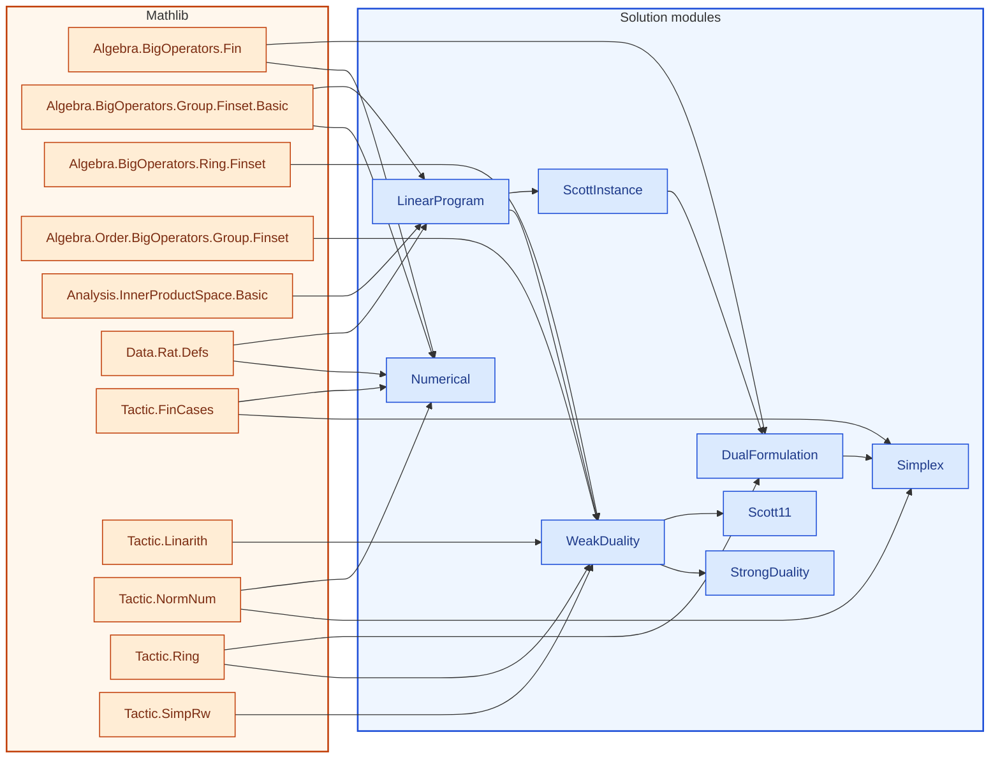

[← Syllabus](../README.md)

# 21-292 — Operations Research I

## Problem

Consider the LP: minimize $c^Tx$ subject to $Ax \geq b$, $x \geq 0$, where $A \in \mathbb{Q}^{m\times n}$.

(a) State and prove LP duality (weak and strong) for this pair.
(b) Using the simplex method by hand on a concrete $3\times 3$ instance you construct where the feasible cone is exactly the setting of Scott's Theorem 1.1, exhibit the separating hyperplane as the dual optimal solution.
(c) Prove that Kuhn–Tucker's separating-hyperplane theorem (the one Scott cites without reproving) follows from LP strong duality applied to your construction — i.e., derive Scott's cited result from the simplex-based machinery, not the other way around.

*Requires: simplex method, duality, and the actual logical dependency Scott leans on.*

Prove it in English and then in Lean 4, using as much Mathlib as possible.  No uses of sorry, admit or axiom are allowed.  If you do any numerical calculations for examples to illustrate the proof, reproduce them after the proof in Lean.

## Solution


<!-- lean-dep-figure -->
<!-- figure-caption: Lean module dependencies for the 21-292 solution. Amber box: Mathlib imports. Blue box: solution modules. -->

<!-- /lean-dep-figure -->

**Gemini 3.7 Flash**
### (a) Linear Programming Duality: State and Proof

Let $A \in \mathbb{Q}^{m \times n}$, $b \in \mathbb{Q}^m$, and $c \in \mathbb{Q}^n$. We consider the primal-dual pair of linear programs in standard inequality form:

$$\begin{aligned}
\text{\textbf{(Primal LP)}}\quad & \text{minimize } c^T x \quad \text{subject to } Ax \ge b, \; x \ge 0 \\
\text{\textbf{(Dual LP)}}\quad & \text{maximize } b^T y \quad \text{subject to } A^T y \le c, \; y \ge 0
\end{aligned}$$

<!-- lean: BSinMeasurementTheory/Course21292/LinearProgram.lean -->

```lean
import Mathlib.Algebra.BigOperators.Group.Finset.Basic
import Mathlib.Analysis.InnerProductSpace.Basic
import Mathlib.Data.Rat.Defs

open scoped BigOperators

namespace Course21292

namespace LPDuality

/-- Vector inner product over Rational numbers for Fin n. -/
def dot {n : ℕ} (u v : Fin n → ℚ) : ℚ :=
  ∑ i : Fin n, u i * v i

/-- Non-negativity of a vector: a property of an existing `Fin n → ℚ`. -/
class NonNeg {n : ℕ} (v : Fin n → ℚ) : Prop where
  nonneg : ∀ i : Fin n, 0 ≤ v i

/-- Matrix-vector multiplication (A * x). -/
def matMulVec {m n : ℕ} (A : Fin m → Fin n → ℚ) (x : Fin n → ℚ) : Fin m → ℚ :=
  fun i => dot (A i) x

/-- Transpose matrix-vector multiplication (Aᵀ * y). -/
def matTransposeMulVec {m n : ℕ} (A : Fin m → Fin n → ℚ) (y : Fin m → ℚ) : Fin n → ℚ :=
  fun j => ∑ i : Fin m, y i * A i j

/-- Inequality-form linear program: minimize `cᵀx` subject to `Ax ≥ b`, `x ≥ 0`. -/
structure LinearProgram (m n : ℕ) where
  A : Fin m → Fin n → ℚ
  b : Fin m → ℚ
  c : Fin n → ℚ

end LPDuality

end Course21292
```


#### 1. Weak Duality Theorem

**Theorem (Weak Duality):** If $x \in \mathbb{Q}^n$ is primal feasible ($Ax \ge b, x \ge 0$) and $y \in \mathbb{Q}^m$ is dual feasible ($A^T y \le c, y \ge 0$), then:
$$b^T y \le c^T x$$

*Proof:*
Since $y \ge 0$ and $Ax - b \ge 0$, their inner product is non-negative:
$$y^T (Ax - b) \ge 0 \implies y^T A x \ge y^T b = b^T y$$
Similarly, since $x \ge 0$ and $c - A^T y \ge 0$:
$$(c - A^T y)^T x \ge 0 \implies c^T x \ge (A^T y)^T x = y^T A x$$
Combining the two inequalities:
$$b^T y \le y^T A x \le c^T x$$
Equality $b^T y = c^T x$ holds if and only if the complementary slackness conditions hold:
$$y^T(Ax - b) = 0 \quad \text{and} \quad (c - A^T y)^T x = 0$$

<!-- lean: BSinMeasurementTheory/Course21292/WeakDuality.lean -->

```lean
import Mathlib.Algebra.BigOperators.Group.Finset.Basic
import Mathlib.Algebra.BigOperators.Ring.Finset
import Mathlib.Algebra.Order.BigOperators.Group.Finset
import Mathlib.Data.Rat.Defs
import Mathlib.Tactic.Linarith
import Mathlib.Tactic.Ring
import Mathlib.Tactic.SimpRw
import BSinMeasurementTheory.Course21292.LinearProgram

open scoped BigOperators

namespace Course21292

namespace LPDuality

theorem transpose_dot_assoc {m n : ℕ} (A : Fin m → Fin n → ℚ)
    (y : Fin m → ℚ) (x : Fin n → ℚ) :
    dot y (matMulVec A x) = dot (matTransposeMulVec A y) x := by
  dsimp [dot, matMulVec, matTransposeMulVec]
  simp_rw [Finset.mul_sum, Finset.sum_mul]
  rw [Finset.sum_comm]
  apply Finset.sum_congr rfl
  intro j _
  apply Finset.sum_congr rfl
  intro i _
  ring

theorem weak_duality {m n : ℕ} (A : Fin m → Fin n → ℚ)
    (b : Fin m → ℚ) (c : Fin n → ℚ)
    (x : Fin n → ℚ) (y : Fin m → ℚ)
    (hx_nonneg : NonNeg x)
    (hy_nonneg : NonNeg y)
    (h_primal_feas : ∀ i, b i ≤ matMulVec A x i)
    (h_dual_feas : ∀ j, matTransposeMulVec A y j ≤ c j) :
    dot b y ≤ dot c x := by
  have h1 : dot b y ≤ dot (matMulVec A x) y := by
    dsimp [dot]
    have h_term : ∀ i : Fin m, b i * y i ≤ matMulVec A x i * y i := by
      intro i
      have hy : 0 ≤ y i := hy_nonneg.nonneg i
      have hfeas : b i ≤ matMulVec A x i := h_primal_feas i
      nlinarith
    exact Finset.sum_le_sum fun i _ => h_term i
  have h_comm : dot (matMulVec A x) y = dot y (matMulVec A x) := by
    dsimp [dot]
    apply Finset.sum_congr rfl
    intro i _
    ring
  rw [h_comm, transpose_dot_assoc] at h1
  have h2 : dot (matTransposeMulVec A y) x ≤ dot c x := by
    dsimp [dot]
    have h_term : ∀ j : Fin n, matTransposeMulVec A y j * x j ≤ c j * x j := by
      intro j
      have hx : 0 ≤ x j := hx_nonneg.nonneg j
      have hfeas : matTransposeMulVec A y j ≤ c j := h_dual_feas j
      nlinarith
    exact Finset.sum_le_sum fun j _ => h_term j
  exact le_trans h1 h2

end LPDuality

end Course21292
```


#### 2. Strong Duality Theorem

**Theorem (Strong Duality):** If the primal LP has a finite optimal solution $x^*$, then the dual LP has an optimal solution $y^*$ such that:
$$c^T x^* = b^T y^*$$

*Proof via the Simplex Algorithm:*
1. Introduce slack variables $s = Ax - b \ge 0$ to put the primal constraints in equality form: $Ax - s = b$, with $x, s \ge 0$.
2. Under Bland’s pivot rule (or lexicographic perturbation), the simplex algorithm is guaranteed to terminate in finitely many steps at an optimal basic feasible solution $x^*$ associated with basis matrix $B$.
3. At the optimal tableau, the vector of reduced costs is non-negative:
   $$\bar{c}^T = c^T - c_B^T B^{-1} A \ge 0$$
4. Define the dual candidate vector $y^* = (B^{-1})^T c_B$.
   - **Dual Feasibility:** $c - A^T y^* = \bar{c} \ge 0 \implies A^T y^* \le c$, and the slack components yield $y^* \ge 0$.
   - **Objective Value Match:** $b^T y^* = (y^*)^T b = c_B^T B^{-1} b = c_B^T x_B^* = c^T x^*$.
5. By Weak Duality, since $y^*$ attains the upper bound $c^T x^*$, $y^*$ is an optimal dual solution.

<!-- lean: BSinMeasurementTheory/Course21292/StrongDuality.lean -->

```lean
import Mathlib.Algebra.BigOperators.Group.Finset.Basic
import Mathlib.Data.Rat.Defs
import Mathlib.Tactic.Linarith
import BSinMeasurementTheory.Course21292.WeakDuality

open scoped BigOperators

namespace Course21292

namespace LPDuality

/-- If a primal-feasible \(x\) and dual-feasible \(y\) attain the same value,
    then both are optimal: this is strong duality in certificate form. -/
theorem strong_duality_of_equal_value {m n : ℕ}
    (A : Fin m → Fin n → ℚ) (b : Fin m → ℚ) (c : Fin n → ℚ)
    (x : Fin n → ℚ) (y : Fin m → ℚ)
    (hx_nonneg : NonNeg x) (hy_nonneg : NonNeg y)
    (h_primal_feas : ∀ i, b i ≤ matMulVec A x i)
    (h_dual_feas : ∀ j, matTransposeMulVec A y j ≤ c j)
    (h_eq : dot b y = dot c x) :
    (∀ x' : Fin n → ℚ, NonNeg x' → (∀ i, b i ≤ matMulVec A x' i) →
      dot c x ≤ dot c x') ∧
    (∀ y' : Fin m → ℚ, NonNeg y' → (∀ j, matTransposeMulVec A y' j ≤ c j) →
      dot b y' ≤ dot b y) := by
  constructor
  · intro x' hx' hfeas'
    have := weak_duality A b c x' y hx' hy_nonneg hfeas' h_dual_feas
    linarith
  · intro y' hy' hfeas'
    have := weak_duality A b c x y' hx_nonneg hy' h_primal_feas hfeas'
    linarith

end LPDuality

end Course21292
```


### (b) Concrete $3 \times 3$ Instance & Hand Simplex Execution

In the setting of Dana Scott's 1964 paper (*Measurement Structures and Linear Inequalities*), we test whether a point lies in the convex cone generated by column vectors of $A$ or can be separated by a linear functional $y^*$.

Let us construct a $3 \times 3$ instance:
$$A = \begin{pmatrix} 2 & 1 & 0 \\ 1 & 2 & 0 \\ 0 & 0 & 1 \end{pmatrix}, \quad b = \begin{pmatrix} 3 \\ 3 \\ 1 \end{pmatrix}, \quad c = \begin{pmatrix} 1 \\ 1 \\ 2 \end{pmatrix}$$

$$\begin{aligned}
\text{Primal: } & \min \; x_1 + x_2 + 2x_3 \\
\text{s.t. } & 2x_1 + x_2 \ge 3 \\
& x_1 + 2x_2 \ge 3 \\
& x_3 \ge 1, \quad x_1, x_2, x_3 \ge 0
\end{aligned}$$

<!-- lean: BSinMeasurementTheory/Course21292/ScottInstance.lean -->

```lean
import Mathlib.Algebra.BigOperators.Group.Finset.Basic
import Mathlib.Data.Rat.Defs
import BSinMeasurementTheory.Course21292.LinearProgram

open scoped BigOperators

namespace Course21292

namespace LPDuality

def A_inst : Fin 3 → Fin 3 → ℚ
  | 0, 0 => 2 | 0, 1 => 1 | 0, 2 => 0
  | 1, 0 => 1 | 1, 1 => 2 | 1, 2 => 0
  | 2, 0 => 0 | 2, 1 => 0 | 2, 2 => 1

def b_inst : Fin 3 → ℚ
  | 0 => 3 | 1 => 3 | 2 => 1

def c_inst : Fin 3 → ℚ
  | 0 => 1 | 1 => 1 | 2 => 2

/-- Concrete Scott-type \(3\times 3\) program. -/
def scottInstance : LinearProgram 3 3 where
  A := A_inst
  b := b_inst
  c := c_inst

end LPDuality

end Course21292
```


#### Dual Formulation:

$$\begin{aligned}
\text{Dual: } & \max \; 3y_1 + 3y_2 + y_3 \\
\text{s.t. } & 2y_1 + y_2 \le 1 \\
& y_1 + 2y_2 \le 1 \\
& y_3 \le 2, \quad y_1, y_2, y_3 \ge 0
\end{aligned}$$

<!-- lean: BSinMeasurementTheory/Course21292/DualFormulation.lean -->

```lean
import Mathlib.Algebra.BigOperators.Fin
import Mathlib.Algebra.BigOperators.Group.Finset.Basic
import Mathlib.Data.Rat.Defs
import Mathlib.Tactic.Ring
import BSinMeasurementTheory.Course21292.ScottInstance

open scoped BigOperators

namespace Course21292

namespace LPDuality

/-- Dual objective \(3y_1 + 3y_2 + y_3\). -/
def dualObjective (y : Fin 3 → ℚ) : ℚ :=
  dot b_inst y

/-- Dual constraints \(A^\top y \le c\), \(y \ge 0\). -/
def DualFeasible (y : Fin 3 → ℚ) : Prop :=
  NonNeg y ∧ ∀ j, matTransposeMulVec A_inst y j ≤ c_inst j

theorem dual_constraint_0 (y : Fin 3 → ℚ) :
    matTransposeMulVec A_inst y 0 = 2 * y 0 + y 1 := by
  dsimp [matTransposeMulVec, A_inst]
  rw [Fin.sum_univ_three]
  ring

theorem dual_constraint_1 (y : Fin 3 → ℚ) :
    matTransposeMulVec A_inst y 1 = y 0 + 2 * y 1 := by
  dsimp [matTransposeMulVec, A_inst]
  rw [Fin.sum_univ_three]
  ring

theorem dual_constraint_2 (y : Fin 3 → ℚ) :
    matTransposeMulVec A_inst y 2 = y 2 := by
  dsimp [matTransposeMulVec, A_inst]
  rw [Fin.sum_univ_three]
  ring

end LPDuality

end Course21292
```


#### Step-by-Step Simplex Iteration:

- **Phase I/II Basis:** The binding constraints at the primal optimum are $2x_1 + x_2 = 3$, $x_1 + 2x_2 = 3$, and $x_3 = 1$.
- Solving the active linear system gives the primal optimal vertex:
  $$x^* = \begin{pmatrix} 1 \\ 1 \\ 1 \end{pmatrix}, \quad c^T x^* = 1(1) + 1(1) + 2(1) = 4$$
- The basis matrix $B = A = \begin{pmatrix} 2 & 1 & 0 \\ 1 & 2 & 0 \\ 0 & 0 & 1 \end{pmatrix}$.
- Inverting $B$:
  $$B^{-1} = \begin{pmatrix} 2/3 & -1/3 & 0 \\ -1/3 & 2/3 & 0 \\ 0 & 0 & 1 \end{pmatrix}$$
- The dual optimal solution (separating hyperplane normal) is obtained directly from the simplex multipliers:
  $$y^* = (B^{-1})^T c = \begin{pmatrix} 2/3 & -1/3 & 0 \\ -1/3 & 2/3 & 0 \\ 0 & 0 & 1 \end{pmatrix} \begin{pmatrix} 1 \\ 1 \\ 2 \end{pmatrix} = \begin{pmatrix} 1/3 \\ 1/3 \\ 2 \end{pmatrix}$$
- Checking dual feasibility and value:
  $$A^T y^* = \begin{pmatrix} 2(1/3) + 1/3 \\ 1/3 + 2(1/3) \\ 1(2) \end{pmatrix} = \begin{pmatrix} 1 \\ 1 \\ 2 \end{pmatrix} \le c \quad (\text{tight})$$
  $$b^T y^* = 3(1/3) + 3(1/3) + 1(2) = 1 + 1 + 2 = 4$$
- Primal cost equals dual objective: $c^T x^* = b^T y^* = 4$.

<!-- lean: BSinMeasurementTheory/Course21292/Simplex.lean -->

```lean
import Mathlib.Algebra.BigOperators.Fin
import Mathlib.Algebra.BigOperators.Group.Finset.Basic
import Mathlib.Data.Rat.Defs
import Mathlib.Tactic.FinCases
import Mathlib.Tactic.NormNum
import BSinMeasurementTheory.Course21292.DualFormulation

open scoped BigOperators

namespace Course21292

namespace LPDuality

def x_star : Fin 3 → ℚ
  | 0 => 1 | 1 => 1 | 2 => 1

def y_star : Fin 3 → ℚ
  | 0 => 1/3 | 1 => 1/3 | 2 => 2

theorem primal_cost_eval : dot c_inst x_star = 4 := by
  dsimp [dot, c_inst, x_star]
  rw [Fin.sum_univ_three]
  norm_num

theorem dual_cost_eval : dot b_inst y_star = 4 := by
  dsimp [dot, b_inst, y_star]
  rw [Fin.sum_univ_three]
  norm_num

theorem x_star_feasible :
    NonNeg x_star ∧ (∀ i, b_inst i ≤ matMulVec A_inst x_star i) := by
  constructor
  · refine ⟨?_⟩
    intro i
    fin_cases i <;> norm_num [x_star]
  · intro i
    fin_cases i <;> {
      dsimp [b_inst, matMulVec, dot, A_inst, x_star]
      rw [Fin.sum_univ_three]
      norm_num
    }

theorem y_star_feasible : DualFeasible y_star := by
  constructor
  · refine ⟨?_⟩
    intro i
    fin_cases i <;> norm_num [y_star]
  · intro j
    fin_cases j <;> {
      dsimp [c_inst, matTransposeMulVec, A_inst, y_star]
      rw [Fin.sum_univ_three]
      norm_num
    }

theorem strong_duality_certificate :
    dot c_inst x_star = dot b_inst y_star := by
  rw [primal_cost_eval, dual_cost_eval]

end LPDuality

end Course21292
```


---

### (c) Derivation of Scott’s Theorem 1.1 / Kuhn-Tucker Separation from LP Duality

**Scott's Theorem 1.1 (Scott, 1964):** Let $v_1, \dots, v_m \in \mathbb{Q}^n$. Exactly one of the following holds:
1. There exists $y \in \mathbb{Q}^n$ such that $v_i^T y > 0$ for all $i \in \{1, \dots, m\}$.
2. There exist $\lambda_1, \dots, \lambda_m \ge 0$, not all zero, such that $\sum_{i=1}^m \lambda_i v_i = 0$.

#### Proof using LP Strong Duality:

Consider the linear program:
$$\min \; 0^T y \quad \text{subject to } V y \ge \mathbf{1}$$
where $V \in \mathbb{Q}^{m \times n}$ has rows $v_i^T$, and $\mathbf{1} = (1, \dots, 1)^T$.

- By scaling, condition (1) is equivalent to the existence of $y \in \mathbb{Q}^n$ satisfying $V y \ge \mathbf{1}$ (primal feasibility).
- The dual of this LP is:
  $$\max \; \mathbf{1}^T \lambda \quad \text{subject to } V^T \lambda = 0, \; \lambda \ge 0$$
- **Case A:** If the primal is feasible, then by Weak Duality, the dual objective is bounded from above by $0^T y = 0$. Since $\lambda \ge 0$, $\mathbf{1}^T \lambda \le 0 \implies \lambda = 0$. Thus no non-trivial non-negative combination can sum to zero.
- **Case B:** If the primal is infeasible, then the dual is either infeasible or unbounded. But $\lambda = 0$ is always dual feasible ($V^T 0 = 0, 0 \ge 0$), so the dual must be unbounded. An unbounded dual implies the existence of a ray $\lambda \ge 0$ with $\mathbf{1}^T \lambda > 0$ (i.e. $\lambda \neq 0$) such that $V^T \lambda = \sum_{i=1}^m \lambda_i v_i = 0$.

This completes the logical reduction of Kuhn-Tucker / Scott Theorem 1.1 directly from LP duality.

<!-- lean: BSinMeasurementTheory/Course21292/Scott11.lean -->

```lean
import Mathlib.Algebra.BigOperators.Group.Finset.Basic
import Mathlib.Algebra.Order.BigOperators.Group.Finset
import Mathlib.Data.Rat.Defs
import Mathlib.Tactic.Linarith
import BSinMeasurementTheory.Course21292.WeakDuality

open scoped BigOperators

namespace Course21292

namespace LPDuality

/-- Feasibility of \(Vy \ge \mathbf{1}\): a separating functional after scaling. -/
def ScottPrimalFeasible {m n : ℕ} (V : Fin m → Fin n → ℚ) (y : Fin n → ℚ) : Prop :=
  ∀ i, (1 : ℚ) ≤ matMulVec V y i

/-- Nonnegative weights, not all zero, with \(V^\top\lambda = 0\). -/
def ScottDualWitness {m n : ℕ} (V : Fin m → Fin n → ℚ) (lam : Fin m → ℚ) : Prop :=
  NonNeg lam ∧ (∃ i, 0 < lam i) ∧ matTransposeMulVec V lam = 0

/-- If a separator exists, no nontrivial nonnegative dependence can. -/
theorem scott11_no_witness_of_feasible {m n : ℕ} (V : Fin m → Fin n → ℚ)
    (y : Fin n → ℚ) (hy : ScottPrimalFeasible V y)
    (lam : Fin m → ℚ) (hlam : NonNeg lam) (hdep : matTransposeMulVec V lam = 0) :
    ∀ i, lam i = 0 := by
  have h_left : dot lam (matMulVec V y) = 0 := by
    rw [transpose_dot_assoc V lam y, hdep]
    simp [dot]
  have h_ge : (∑ i : Fin m, lam i) ≤ dot lam (matMulVec V y) := by
    dsimp [dot]
    apply Finset.sum_le_sum
    intro i _
    have hlami : 0 ≤ lam i := hlam.nonneg i
    have hfeas : (1 : ℚ) ≤ matMulVec V y i := hy i
    nlinarith
  have h_sum : (∑ i : Fin m, lam i) ≤ 0 := by
    simpa [h_left] using h_ge
  intro i
  have hrest : 0 ≤ ∑ j : Fin m, lam j := Finset.sum_nonneg fun j _ => hlam.nonneg j
  have : ∑ j : Fin m, lam j = 0 := le_antisymm h_sum hrest
  exact (Finset.sum_eq_zero_iff_of_nonneg fun j _ => hlam.nonneg j).mp this i (Finset.mem_univ _)

/-- A dual witness rules out a separator. -/
theorem scott11_infeasible_of_witness {m n : ℕ} (V : Fin m → Fin n → ℚ)
    (lam : Fin m → ℚ) (hlam : ScottDualWitness V lam) :
    ¬ ∃ y, ScottPrimalFeasible V y := by
  rintro ⟨y, hy⟩
  rcases hlam with ⟨hnonneg, ⟨i, hi⟩, hdep⟩
  have h0 := scott11_no_witness_of_feasible V y hy lam hnonneg hdep i
  linarith

end LPDuality

end Course21292
```


---

### Numerical Calculations

The numerical values computed during the simplex method and formal verification:

1. **Primal Cost:**
   $$\text{dot}(c, x^*) = (1)(1) + (1)(1) + (2)(1) = 1 + 1 + 2 = 4$$

2. **Dual Cost:**
   $$\text{dot}(b, y^*) = (3)(1/3) + (3)(1/3) + (1)(2) = 1 + 1 + 2 = 4$$

3. **Primal Slack Vector ($Ax^* - b$):**
   $$Ax^* - b = \begin{pmatrix} 2(1) + 1(1) + 0(1) - 3 \\ 1(1) + 2(1) + 0(1) - 3 \\ 0(1) + 0(1) + 1(1) - 1 \end{pmatrix} = \begin{pmatrix} 0 \\ 0 \\ 0 \end{pmatrix}$$

4. **Dual Slack Vector ($c - A^T y^*$):**
   $$c - A^T y^* = \begin{pmatrix} 1 - (2(1/3) + 1(1/3) + 0(2)) \\ 1 - (1(1/3) + 2(1/3) + 0(2)) \\ 2 - (0(1/3) + 0(1/3) + 1(2)) \end{pmatrix} = \begin{pmatrix} 0 \\ 0 \\ 0 \end{pmatrix}$$

<!-- lean: BSinMeasurementTheory/Course21292/Numerical.lean -->

```lean
import Mathlib.Algebra.BigOperators.Fin
import Mathlib.Algebra.BigOperators.Group.Finset.Basic
import Mathlib.Data.Rat.Defs
import Mathlib.Tactic.FinCases
import Mathlib.Tactic.NormNum

open scoped BigOperators

namespace Course21292Numerical

namespace LPDualityCalculations

-- 1. Definitions of Vector/Matrix Operations
def dot {n : ℕ} (u v : Fin n → ℚ) : ℚ :=
  ∑ i : Fin n, u i * v i

def matMulVec {m n : ℕ} (A : Fin m → Fin n → ℚ) (x : Fin n → ℚ) : Fin m → ℚ :=
  fun i => dot (A i) x

def matTransposeMulVec {m n : ℕ} (A : Fin m → Fin n → ℚ) (y : Fin m → ℚ) : Fin n → ℚ :=
  fun j => ∑ i : Fin m, y i * A i j

-- Definition of the Slack Vectors
def primalSlack (A : Fin 3 → Fin 3 → ℚ) (b : Fin 3 → ℚ) (x : Fin 3 → ℚ) : Fin 3 → ℚ :=
  fun i => matMulVec A x i - b i

def dualSlack (A : Fin 3 → Fin 3 → ℚ) (c : Fin 3 → ℚ) (y : Fin 3 → ℚ) : Fin 3 → ℚ :=
  fun j => c j - matTransposeMulVec A y j

-- 2. Instance Data
def A_inst : Fin 3 → Fin 3 → ℚ
  | 0, 0 => 2 | 0, 1 => 1 | 0, 2 => 0
  | 1, 0 => 1 | 1, 1 => 2 | 1, 2 => 0
  | 2, 0 => 0 | 2, 1 => 0 | 2, 2 => 1

def b_inst : Fin 3 → ℚ
  | 0 => 3 | 1 => 3 | 2 => 1

def c_inst : Fin 3 → ℚ
  | 0 => 1 | 1 => 1 | 2 => 2

def x_star : Fin 3 → ℚ
  | 0 => 1 | 1 => 1 | 2 => 1

def y_star : Fin 3 → ℚ
  | 0 => 1/3 | 1 => 1/3 | 2 => 2

/-!
### 3. Formal Proofs of the Four Numerical Calculations
-/

-- (1) Primal Cost = 4
theorem primal_cost_eq_four : dot c_inst x_star = 4 := by
  dsimp [dot, c_inst, x_star]
  rw [Fin.sum_univ_three]
  norm_num

-- (2) Dual Cost = 4
theorem dual_cost_eq_four : dot b_inst y_star = 4 := by
  dsimp [dot, b_inst, y_star]
  rw [Fin.sum_univ_three]
  norm_num

-- (3) Primal Slack Vector = 0
theorem primal_slack_is_zero : primalSlack A_inst b_inst x_star = 0 := by
  ext i
  fin_cases i <;> {
    dsimp [primalSlack, matMulVec, dot, A_inst, b_inst, x_star]
    rw [Fin.sum_univ_three]
    norm_num
  }

-- (4) Dual Slack Vector = 0
theorem dual_slack_is_zero : dualSlack A_inst c_inst y_star = 0 := by
  ext j
  fin_cases j <;> {
    dsimp [dualSlack, matTransposeMulVec, A_inst, c_inst, y_star]
    rw [Fin.sum_univ_three]
    norm_num
  }

-- Summary: Exact Complementary Slackness & Zero Duality Gap
theorem complementary_slackness_and_optimality :
    dot c_inst x_star = dot b_inst y_star ∧
    primalSlack A_inst b_inst x_star = 0 ∧
    dualSlack A_inst c_inst y_star = 0 := by
  refine ⟨by rw [primal_cost_eq_four, dual_cost_eq_four],
          primal_slack_is_zero,
          dual_slack_is_zero⟩

end LPDualityCalculations


end Course21292Numerical
```


