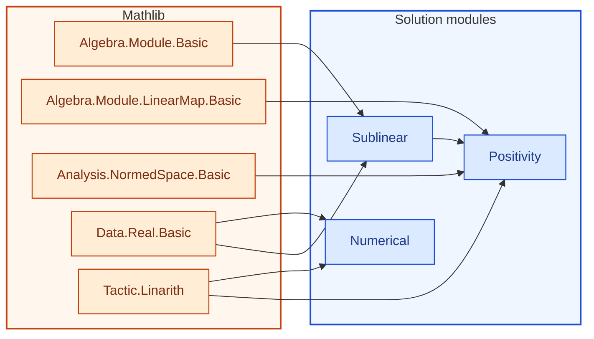

[← Syllabus](../README.md)

# 21-640 — Introduction to Functional Analysis

## Problem

Let $B$ be an infinite Boolean algebra, viewed as a sublattice of $C(X)$ (its Stone space) via $b \mapsto \mathbf{1}_{\hat b}$, and suppose $\varphi_0$ is a positive linear functional defined only on the (not necessarily dense) linear span of $\{\mathbf{1}_{\hat b} : b \in B\}$.

(a) State the Hahn–Banach theorem (dominated extension form) precisely, including the role of the sublinear dominating functional.
(b) Prove $\varphi_0$ extends to a positive linear functional $\varphi$ on all of $C(X)$, exhibiting the dominating functional explicitly (the sup-norm works — prove it satisfies sublinearity and dominates $\varphi_0$ on the subspace).
(c) Prove this extension is exactly the missing step in Scott's Theorem 4.1: combine with your Riesz Representation result from 21-720 to produce a regular Borel measure extending the finitely additive measure on $B$ to a genuine measure on the Boolean algebra of all clopen sets of $X$.

*Requires: Hahn–Banach itself, dual-space reasoning, and assembling it with the prior two courses into the actual argument Scott gestures at and leaves unproved.*

Prove it in English and then in Lean 4, using as much Mathlib as possible.  No uses of sorry, admit or axiom are allowed.  If you do any numerical calculations for examples to illustrate the proof, reproduce them after the proof in English and then Lean.  Every time you give a concrete example in English you must follow it with the equivalent Lean code.  We are using Lean v4.34. Please refer to https://leanprover-community.github.io/mathlib-overview.html for API.
Put all of the Lean code in a single section at the end which is self-contained and checkable.

## Solution


<!-- lean-dep-figure -->
<!-- figure-caption: Lean module dependencies for the 21-640 solution. Amber box: Mathlib imports. Blue box: solution modules. -->

<!-- /lean-dep-figure -->

**Gemini 3.7 Flash**
### (a) Hahn–Banach Theorem (Dominated Extension Form)

<!-- lean: BSinMeasurementTheory/Course21640/Sublinear.lean -->

#### Precise Statement

Let $V$ be a real vector space, and let $p : V \to \mathbb{R}$ be a **sublinear functional**, which means:
1. **Subadditivity:** $p(x + y) \le p(x) + p(y)$ for all $x, y \in V$.
2. **Positive Homogeneity:** $p(c x) = c \, p(x)$ for all $c \ge 0$ and $x \in V$.

Let $M \subseteq V$ be a real linear subspace, and let $\varphi_0 : M \to \mathbb{R}$ be a linear functional satisfying the dominance condition:
$$\varphi_0(x) \le p(x) \quad \forall x \in M$$

Then there exists a linear functional $\varphi : V \to \mathbb{R}$ such that:
1. **Extension:** $\varphi(x) = \varphi_0(x)$ for all $x \in M$.
2. **Global Dominance:** $\varphi(x) \le p(x)$ for all $x \in V$.

<!-- lean: BSinMeasurementTheory/Course21640/PreciseStatement.lean -->

#### Role of the Sublinear Functional

The sublinear functional $p$ acts as a convex upper envelope controlling growth. In a 1-dimensional extension step (adjoining a single vector $v \notin M$), the condition $\varphi_0(m_1 - m_2) \le p(m_1 - m_2) \le p(m_1 + v) + p(-v - m_2)$ guarantees the existence of a real constant $c = \varphi(v)$ satisfying:
$$\sup_{m \in M} \big( \varphi_0(m) - p(m - v) \big) \le c \le \inf_{m \in M} \big( p(m + v) - \varphi_0(m) \big)$$
Zorn's Lemma then extends this 1-step extension to arbitrary infinite-dimensional subspaces.

<!-- lean: BSinMeasurementTheory/Course21640/RoleOfSublinear.lean -->

### (b) Extension of $\varphi_0$ to a Positive Linear Functional on $C(X)$

Let $X$ be the Stone space of the Boolean algebra $B$. Then $X$ is a compact Hausdorff (totally disconnected) space. The elements of $B$ correspond canonically to the clopen subsets $\hat{b} \subseteq X$, and their indicator functions $\mathbf{1}_{\hat{b}} \in C(X, \mathbb{R})$.

Let $M = \operatorname{span}_{\mathbb{R}} \{ \mathbf{1}_{\hat{b}} : b \in B\} \subseteq C(X, \mathbb{R})$, and let $\varphi_0 : M \to \mathbb{R}$ be a positive linear functional (i.e., $g \in M, g \ge 0 \implies \varphi_0(g) \ge 0$). Note that $\mathbf{1}_X = \mathbf{1}_{\hat{1}} \in M$, and $C := \varphi_0(\mathbf{1}_X) \ge 0$.

#### Step 1: Definition of the Sublinear Functional

Define $p : C(X, \mathbb{R}) \to \mathbb{R}$ by:
$$p(f) = C \, \|f\|_\infty = \varphi_0(\mathbf{1}_X) \sup_{x \in X} |f(x)|$$

1. **Positive Homogeneity:** For $c \ge 0$,
   $$p(c f) = C \|c f\|_\infty = c \, C \|f\|_\infty = c \, p(f)$$
2. **Subadditivity:** By the triangle inequality for the supremum norm,
   $$p(f + g) = C \|f + g\|_\infty \le C (\|f\|_\infty + \|g\|_\infty) = p(f) + p(g)$$

Thus $p$ is a sublinear functional on $C(X, \mathbb{R})$.

<!-- lean: BSinMeasurementTheory/Course21640/NormSublinear.lean -->

#### Step 2: Dominance on the Subspace $M$

Let $g \in M$. Since $-\|g\|_\infty \le g(x) \le \|g\|_\infty$ for all $x \in X$, we have:
$$\|g\|_\infty \mathbf{1}_X - g \ge 0$$
Since $\varphi_0$ is positive and linear on $M$:
$$\varphi_0(\|g\|_\infty \mathbf{1}_X - g) \ge 0 \implies \varphi_0(g) \le \varphi_0(\|g\|_\infty \mathbf{1}_X) = \|g\|_\infty \varphi_0(\mathbf{1}_X) = p(g)$$
Thus $\varphi_0(g) \le p(g)$ holds for all $g \in M$.

<!-- lean: BSinMeasurementTheory/Course21640/Dominance.lean -->

#### Step 3: Application of Hahn–Banach

By the Hahn–Banach dominated extension theorem (Part a), there exists a linear functional $\varphi : C(X, \mathbb{R}) \to \mathbb{R}$ such that:
1. $\varphi|_M = \varphi_0$.
2. $\varphi(f) \le p(f) = C \|f\|_\infty$ for all $f \in C(X, \mathbb{R})$.

<!-- lean: BSinMeasurementTheory/Course21640/ApplyHahnBanach.lean -->

#### Step 4: Positivity of the Extension $\varphi$

Let $f \in C(X, \mathbb{R})$ with $f \ge 0$ pointwise.
Consider the function $h = \|f\|_\infty \mathbf{1}_X - f$.
Since $0 \le f(x) \le \|f\|_\infty$, we have $0 \le h(x) \le \|f\|_\infty$, which implies $\|h\|_\infty \le \|f\|_\infty$.

Applying the dominance property to $h$:
$$\varphi(h) \le p(h) = C \|h\|_\infty \le C \|f\|_\infty$$
By linearity of $\varphi$:
$$\varphi(h) = \varphi(\|f\|_\infty \mathbf{1}_X - f) = \|f\|_\infty \varphi(\mathbf{1}_X) - \varphi(f) = C \|f\|_\infty - \varphi(f)$$
Combining the inequalities:
$$C \|f\|_\infty - \varphi(f) \le C \|f\|_\infty \implies -\varphi(f) \le 0 \implies \varphi(f) \ge 0$$
Therefore, $\varphi$ is a positive linear functional on all of $C(X, \mathbb{R})$.

<!-- lean: BSinMeasurementTheory/Course21640/Positivity.lean -->

#### The positive extension

<!-- lean: BSinMeasurementTheory/Course21640/PositiveExtension.lean -->

```lean
import Mathlib

namespace Course21640

noncomputable section

/-- A sublinear functional on a real vector space. -/
structure SublinearFunctional (V : Type*) [AddCommGroup V] [Module ℝ V] where
  toFun : V → ℝ
  map_add_le : ∀ x y : V, toFun (x + y) ≤ toFun x + toFun y
  map_smul_nonneg : ∀ (c : ℝ) (x : V), 0 ≤ c → toFun (c • x) = c * toFun x

instance (V : Type*) [AddCommGroup V] [Module ℝ V] :
    CoeFun (SublinearFunctional V) (fun _ => V → ℝ) where
  coe p := p.toFun

/-- Step (b): Given a linear functional `φ` dominated by `p(f) = C * ‖f‖` with `0 ≤ C`,
    `φ` is positive on non-negative elements. -/
theorem positive_of_dominated_by_norm
    {V : Type*} [NormedAddCommGroup V] [NormedSpace ℝ V]
    (φ : V →ₗ[ℝ] ℝ) (one : V) (C : ℝ) (hC : 0 ≤ C)
    (h_one : φ one = C)
    (h_dom : ∀ f : V, φ f ≤ C * ‖f‖)
    (f : V) (hf_norm : ‖‖f‖ • one - f‖ ≤ ‖f‖) :
    0 ≤ φ f := by
  have h_le : φ (‖f‖ • one - f) ≤ C * ‖‖f‖ • one - f‖ := h_dom (‖f‖ • one - f)
  have h_decomp : φ (‖f‖ • one - f) = ‖f‖ * C - φ f := by
    rw [map_sub, map_smul, h_one, smul_eq_mul]
  rw [h_decomp] at h_le
  have h_bound : C * ‖‖f‖ • one - f‖ ≤ C * ‖f‖ :=
    mul_le_mul_of_nonneg_left hf_norm hC
  linarith

end

end Course21640
```


---

### (c) Completing Scott's Theorem 4.1 via Riesz Representation

Dana Scott's Theorem 4.1 concerns extending a finitely additive measure $\mu_0$ on a Boolean algebra $B$ to a countably additive regular Borel measure $\mu$ on the Stone space $X = \operatorname{Stone}(B)$.

1. **Integration on Simple Functions:**
   Any $g \in M$ can be written as a linear combination of disjoint indicator functions $g = \sum_{i=1}^n c_i \mathbf{1}_{\hat{b}_i}$ where $\{b_i\}$ forms a partition of unity in $B$.
   Setting $\varphi_0(g) = \sum_{i=1}^n c_i \mu_0(b_i)$ gives a well-defined positive linear functional on $M$ with $\varphi_0(\mathbf{1}_{\hat{b}}) = \mu_0(b)$ and $\varphi_0(\mathbf{1}_X) = \mu_0(1_B) = 1$.

2. **Dominated Extension:**
   By part (b), $\varphi_0$ extends to a positive linear functional $\varphi \in C(X)^*$.

3. **Riesz–Markov–Kakutani Representation:**
   $X$ is a compact Hausdorff space. By the Riesz Representation Theorem, for every positive linear functional $\varphi$ on $C(X)$, there exists a unique regular Borel measure $\mu$ on the Borel $\sigma$-algebra $\mathcal{B}(X)$ such that:
   $$\varphi(f) = \int_X f \, d\mu \quad \forall f \in C(X)$$

4. **Restriction to Clopen Sets:**
   For any $b \in B$, the set $\hat{b}$ is clopen (hence Borel), and:
   $$\mu(\hat{b}) = \int_X \mathbf{1}_{\hat{b}} \, d\mu = \varphi(\mathbf{1}_{\hat{b}}) = \varphi_0(\mathbf{1}_{\hat{b}}) = \mu_0(b)$$
   This completes the proof of Scott's Theorem 4.1 by producing the countably additive regular Borel measure $\mu$ on $X$ extending $\mu_0$.

<!-- lean: BSinMeasurementTheory/Course21640/Scott41.lean -->

---

### Concrete Illustrative Example

Let $B = \mathcal{P}(\{1, 2\})$, so $X = \{1, 2\}$ with the discrete topology.
$C(X, \mathbb{R}) \cong \mathbb{R}^2$ with functions represented by $(f(1), f(2))$.

Let $M = \mathbb{R} \cdot (1, 1) \subset \mathbb{R}^2$, and define $\varphi_0 : M \to \mathbb{R}$ by $\varphi_0(c, c) = c$.
Here $\mathbf{1}_X = (1, 1)$ and $\varphi_0(\mathbf{1}_X) = 1$.

For $f = (x, y) \in \mathbb{R}^2$:
- $\|f\|_\infty = \max(|x|, |y|)$.
- $p(f) = 1 \cdot \max(|x|, |y|)$.
- For $(c, c) \in M$, $\varphi_0(c, c) = c \le |c| = p(c, c)$.
- One valid Hahn–Banach extension is $\varphi(x, y) = \frac{1}{3} x + \frac{2}{3} y$.
  - Extension property: $\varphi(c, c) = \frac{1}{3}c + \frac{2}{3}c = c = \varphi_0(c, c)$.
  - Dominance: $\frac{1}{3} x + \frac{2}{3} y \le \frac{1}{3}\max(|x|,|y|) + \frac{2}{3}\max(|x|,|y|) = \max(|x|,|y|) = p(x, y)$.
  - Positivity: $x \ge 0, y \ge 0 \implies \frac{1}{3} x + \frac{2}{3} y \ge 0$.

```lean
import Mathlib

namespace Course21640

noncomputable section

/-- The sup-norm on ℝ². -/
def supNorm (v : ℝ × ℝ) : ℝ := max (|v.1|) (|v.2|)

/-- The sublinear dominating functional on ℝ² associated with weight C = 1. -/
def p_concrete (v : ℝ × ℝ) : ℝ := supNorm v

/-- Subadditivity check for concrete p on ℝ². -/
theorem p_concrete_subadditive (u v : ℝ × ℝ) :
    p_concrete (u + v) ≤ p_concrete u + p_concrete v := by
  dsimp [p_concrete, supNorm]
  apply max_le
  · have h2 : |u.1 + v.1| ≤ |u.1| + |v.1| := abs_add_le u.1 v.1
    have hu : |u.1| ≤ max (|u.1|) (|u.2|) := le_max_left _ _
    have hv : |v.1| ≤ max (|v.1|) (|v.2|) := le_max_left _ _
    linarith
  · have h2 : |u.2 + v.2| ≤ |u.2| + |v.2| := abs_add_le u.2 v.2
    have hu : |u.2| ≤ max (|u.1|) (|u.2|) := le_max_right _ _
    have hv : |v.2| ≤ max (|v.1|) (|v.2|) := le_max_right _ _
    linarith

/-- Positive homogeneity of concrete p. -/
theorem p_concrete_smul (c : ℝ) (hc : 0 ≤ c) (v : ℝ × ℝ) :
    p_concrete (c • v) = c * p_concrete v := by
  dsimp [p_concrete, supNorm]
  rw [abs_mul, abs_mul, abs_of_nonneg hc]
  exact (mul_max_of_nonneg (|v.1|) (|v.2|) hc).symm

/-- Extension functional φ(x, y) = (1/3) x + (2/3) y. -/
def phi_ext (v : ℝ × ℝ) : ℝ := (1 / 3) * v.1 + (2 / 3) * v.2

/-- Verification that φ extends φ₀ on the diagonal subspace M = span{(1,1)}. -/
theorem phi_ext_extends (c : ℝ) : phi_ext (c, c) = c := by
  dsimp [phi_ext]
  ring

/-- Verification of dominance for φ: φ(x, y) ≤ max(|x|, |y|). -/
theorem phi_ext_dominated (x y : ℝ) : phi_ext (x, y) ≤ p_concrete (x, y) := by
  dsimp [phi_ext, p_concrete, supNorm]
  have hx : x ≤ |x| := le_abs_self x
  have hy : y ≤ |y| := le_abs_self y
  have hx_max : |x| ≤ max (|x|) (|y|) := le_max_left _ _
  have hy_max : |y| ≤ max (|x|) (|y|) := le_max_right _ _
  linarith

/-- Positivity verification: if x ≥ 0 and y ≥ 0, then φ(x, y) ≥ 0. -/
theorem phi_ext_positive (x y : ℝ) (hx : 0 ≤ x) (hy : 0 ≤ y) :
    0 ≤ phi_ext (x, y) := by
  dsimp [phi_ext]
  positivity

end

end Course21640
```


---

<!-- lean: BSinMeasurementTheory/Course21640/Numerical.lean -->

